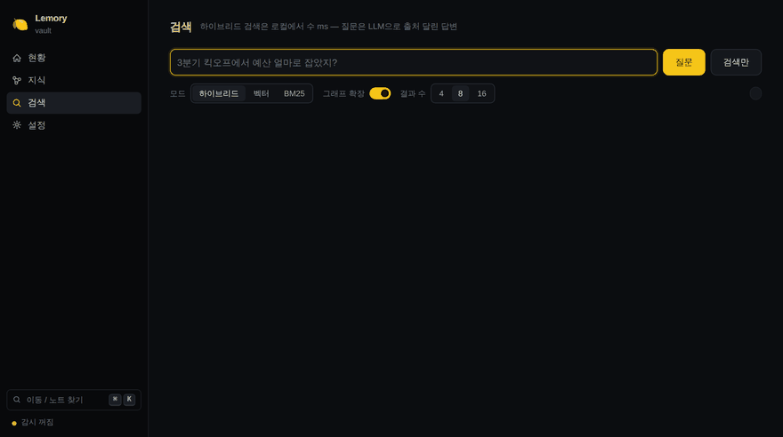

<div align="center">

# 🍋 Lemory

### 기억은 당신의 것이어야 합니다.
**남의 데이터베이스 행이 아니라, 당신 볼트 안의 마크다운 파일로.**



<sub>목업이 아닙니다 — **옵시디언 CEO(Steph Ango)의 실제 공개 볼트**에서 2-hop
질문("Steph 미팅" 노트 → "Out of Control" 노트)이 출처와 함께 답변되는
장면입니다. [`benchmarks/data/kepano`](benchmarks/data/kepano)로 재현됩니다.</sub>

</div>

---

**Lemory는 당신의 마크다운을 위한 로컬 메모리 미들웨어입니다.** 당신의 노트와
당신이 쓰는 모든 AI — Claude Desktop, Claude Code, Cursor, 직접 짠 스크립트 —
사이에 앉아서, 당신이 적어둔 모든 것을 AI가 기억해내게 하고, 기억할 가치가
있는 것을 당신 소유의 마크다운 파일로 만들어 줍니다.

- **AI가 기억을 꺼냅니다**: 시맨틱 + 키워드 + 위키링크 그래프 하이브리드 검색.
  경쟁 제품 전부와 같은 조건에서 실측하고, 지는 항목도 공개합니다.
- **AI가 기억을 넣습니다**: 결정사항·사실이 볼트 안의 순수 `.md` 노트로
  저장됩니다 — 옵시디언에서 보이고, 버전 관리되고, `rm` 한 번이면 사라집니다.
  독점 저장소도, 내보내기 버튼도, 이사할 데이터도 없습니다.
- **미들웨어를 지켜봅니다**: 대시보드가 지나간 모든 것을 보여줍니다 — 모든
  질의, AI가 적은 모든 노트(옵시디언 휴지통으로 원클릭 되돌리기), 클라이언트별
  사용량. 전부 로컬, SQLite 파일 하나.

업계의 메모리 제품들은 당신의 지식을 **자기들** 데이터베이스의 행으로
원합니다 — Postgres, Qdrant, 호스티드 API. 우리는 당신이 이미 소유한 파일이
더 나은 데이터베이스라고 생각하고, 그게 정확도를 희생하지 않는다는 걸
벤치마크로 증명했습니다. 오히려 그 반대라는 것도요.

## 2분 시작

```bash
pipx install "git+https://github.com/jwgo/lemory"
lemory setup      # 볼트 경로 + 무료 Gemini 키 (또는 완전 로컬 모드) → 첫 색인
lemory ask "요새 내가 하던 그 프로젝트 어디까지 했지?"
```

키가 없어도 됩니다 — `lemory setup`이 완전 오프라인 모드 두 가지(Ollama
풀로컬 / fastembed 검색전용)를 제안합니다. 인제스트에 LLM이 돌지 않아서
**노트 1,000개 색인 = LLM 호출 0회**, 몇 초면 검색됩니다. 어떤 경쟁 제품은
54노트 볼트의 그래프를 만드는 데 LLM 45분을 태웁니다 — 당신의 위키링크가
이미 그래프인데요.

**처음이라면: [docs/GUIDE.ko.md](docs/GUIDE.ko.md)**

## Claude에게 기억을 주기

```bash
claude mcp add lemory -- lemory mcp --vault ~/Obsidian/MyVault --client claude-desktop
```

10개 툴 — 읽기 8개(검색·질문·최근·관련·컨텍스트 등) + **쓰기 2개**
(save_memory·append_note). Claude가 결정과 사실을 **볼트 안의 순수 마크다운
노트로** 저장합니다. 덮어쓰기 불가, 볼트 탈출 불가, 추가 전용. `CLAUDE.md`에
자동 기억 지침 한 단락을 넣으면 mem0/supermemory식 라이프사이클이 클라우드
없이 됩니다 (영문 README에 스니펫).

AI가 적은 모든 노트는 대시보드의 **AI 메모리 피드**에 "누가, 언제"와 함께
뜨고, 휴지통 버튼 하나로 되돌립니다(`.trash` — 옵시디언 자체 휴지통. 사람이
쓴 노트는 구조적으로 거부). 모든 질의는 **최근 질의**에 출처와 함께 뜹니다.
아무것도 보이지 않게 지나가지 않습니다 — 그게 미들웨어의 계약입니다.


## 딸깍 한 번

```bash
lemory up ~/Obsidian/MyVault    # 키 감지 → 모드 자동 선택 → 색인 → 대시보드
```

질문 없이 끝납니다. Gemini 키가 있으면 풀 모드, 없고 fastembed가 있으면 로컬
검색 모드, 둘 다 없으면 **키리스 모드**(BM25+링크 그래프 — 그래도 유용하고,
나중에 키를 넣으면 다음 색인에서 자동 업그레이드)로 알아서 동작합니다.

## 실측 증명 — 실제 데이터로

**사람이 실제로 묻는 방식** (패러프레이즈 / 한국어 질문 → 영어 노트 / 키워드 / 오타):

| | 원문 | 패러프레이즈 | 한국어 질문 | 키워드 | 오타 |
|---|---|---|---|---|---|
| **Lemory** | **1.000** | **0.982** | **1.000** | **0.982** | **0.965** |
| 벡터 전용 | 0.544 | 0.464 | 0.475 | 0.482 | 0.491 |
| BM25 | 0.579 | 0.429 | 0.250 | 0.482 | 0.404 |

**경쟁 제품과** (같은 코퍼스·같은 모델, [방법론](BENCHMARKS.md)):

| | **Lemory** | mem0 | cognee | supermemory | LlamaIndex | qmd |
|---|---|---|---|---|---|---|
| 멀티홉 answer-in-context@8 | **1.000** | 0.579 | 0.561 | 0.579 | 0.649 | 0.526 |
| 검색 지연 (p50) | **~3 ms** | 212 ms | ~5 s | 327 ms | 649 ms | 0.6–59 s |

**옵시디언 CEO의 실제 공개 볼트(kepano)** 에서도: 2-hop full-support
**1.000** (스텁 보강 전 0.500 — 진짜 볼트는 3줄짜리 스텁 투성이라는 걸 여기서
배웠습니다), 벡터 전용 대비 우위. KorQuAD처럼 BM25한테 지는 표도 그대로
공개합니다 (영문 README·[BENCHMARKS.md](BENCHMARKS.md)).

## 이런 게 됩니다

```
$ lemory ask "3분기 킥오프에서 예산 얼마로 잡았지?"
$ lemory ask "프로젝트 아틀라스 리드가 좋아하는 DB가 뭐더라?"   # 멀티홉
$ lemory ask "요새 내가 읽던 책 뭐였지?"                        # 시간 이해
$ lemory search "tag:회의록 folder:2026 예산"                   # 스코프 연산자
$ lemory remember "VPN 갱신은 매년 3월, 담당 김하늘" --tags ops  # CLI에서 기억 쓰기
$ lemory import-chats conversations.json    # ChatGPT/Claude 대화 → 검색되는 노트
$ lemory context                            # 에이전트용 볼트 요약 한 방
```

## 큰 볼트도, 망분리도 됩니다

- 나무위키 실문서 1,469편(청크 33,375개, 실제 위키링크 24,850개)을 그대로
  색인해 검증 — recall@8 1.00.
- 청크 2만 개를 넘으면 IVF-int8 인덱스로 자동 전환(여전히 numpy뿐):
  **청크 100만 개에서 5.9ms/질의, 정확 검색 대비 recall 1.000, RAM 4분의 1**.
- SQLite를 DuckDB/LanceDB로 바꾸는 것까지 실측해 보고서로 공개
  ([docs/STORAGE.md](docs/STORAGE.md)) — 안 바꾸는 근거도 숫자입니다.
- 완전 오프라인 모드: 외부로 나가는 바이트 0 — 망분리·폐쇄망 환경에서
  그대로 돌아갑니다. PDF 색인은 opt-in.

## 대시보드

`lemory serve` → `127.0.0.1:8377`. 옵시디언을 복제한 화면이 아니라
**미들웨어를 지나간 것**을 보는 화면입니다: AI 메모리 피드(되돌리기 포함),
최근 질의와 출처, 클라이언트별 사용량, 색인 활동, 노트별 참조 횟수와 로컬
그래프(옵시디언 그래프에 없는 '언급' 간선까지), 관련 노트, 검색 플레이그라운드,
라이브 설정.

MIT · 이슈/PR 환영 · **[English README](README.md)**
