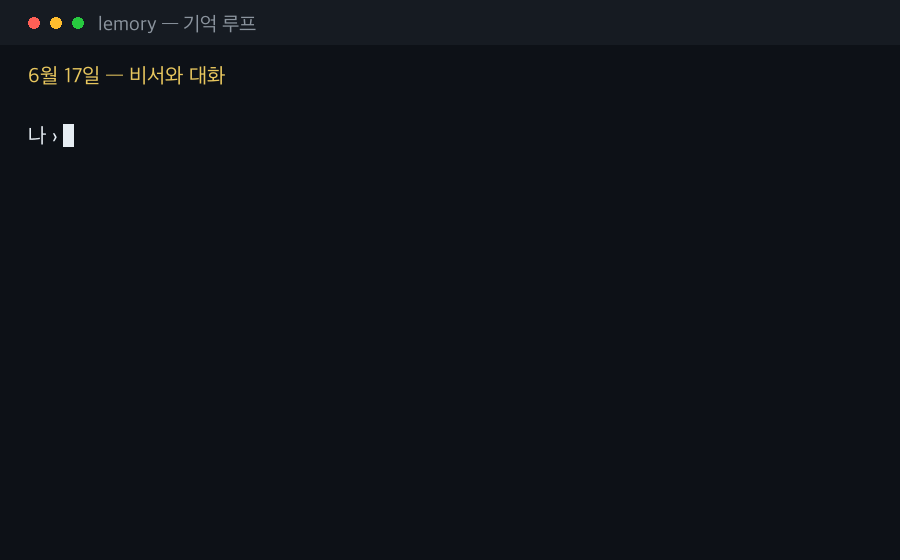
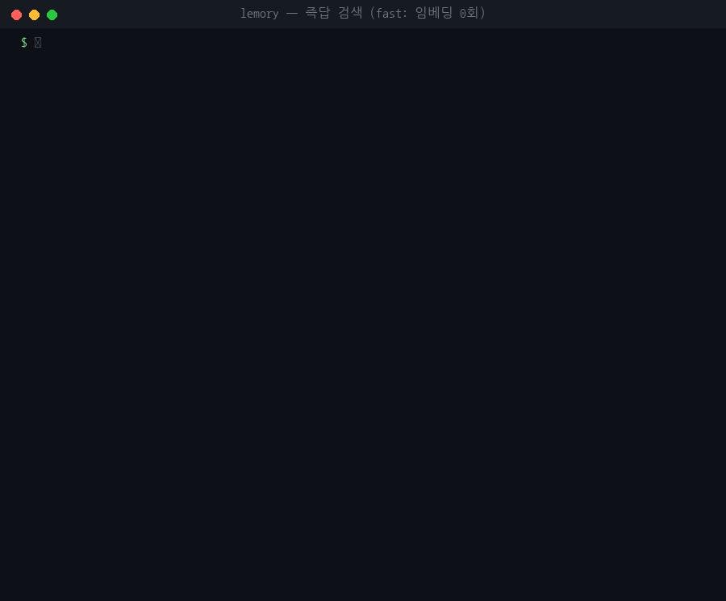
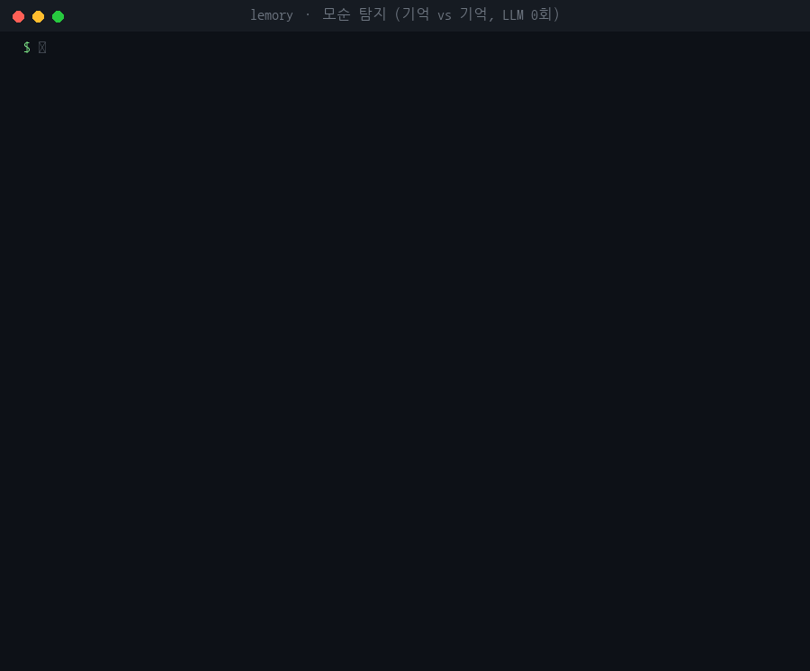
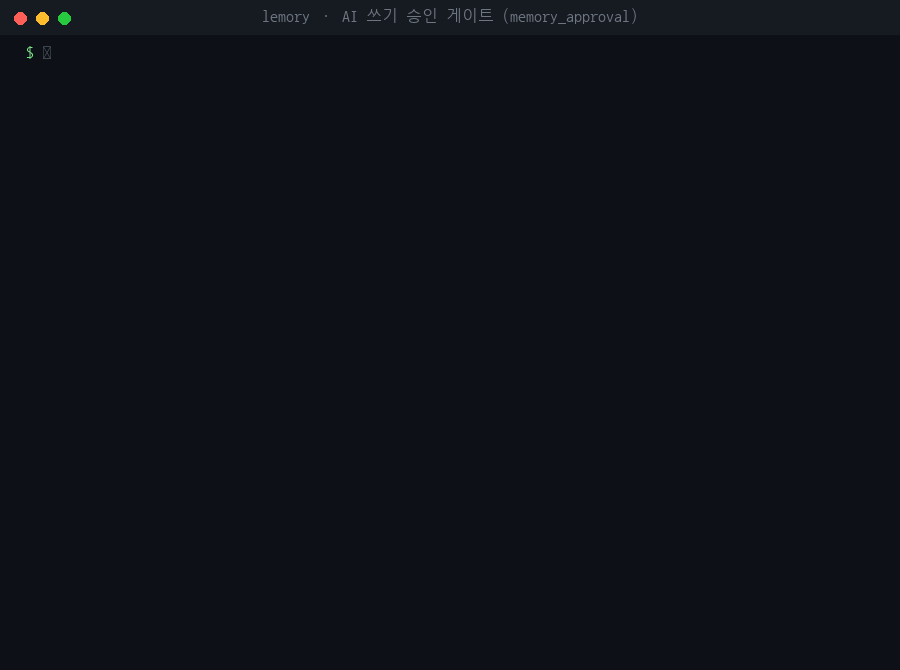
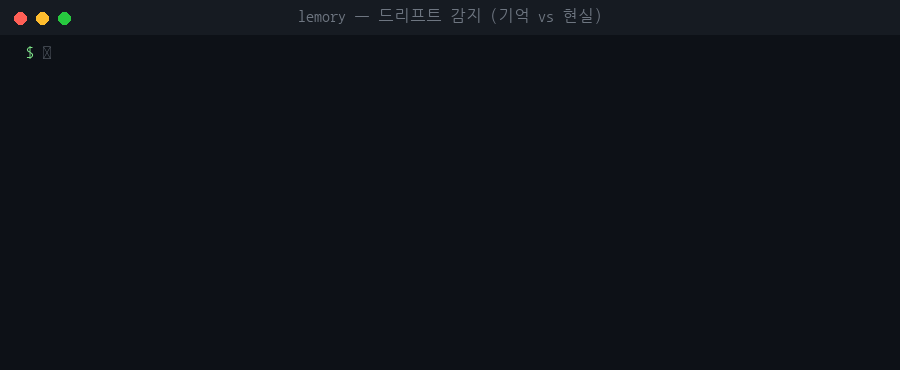
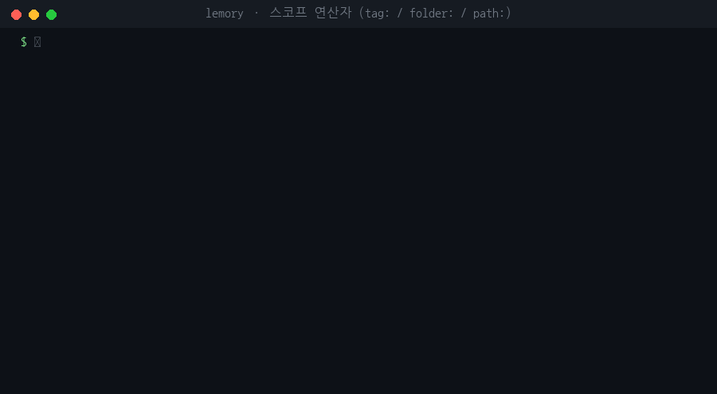
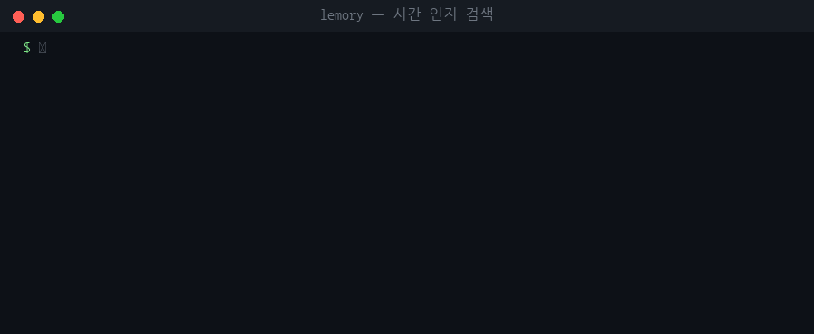
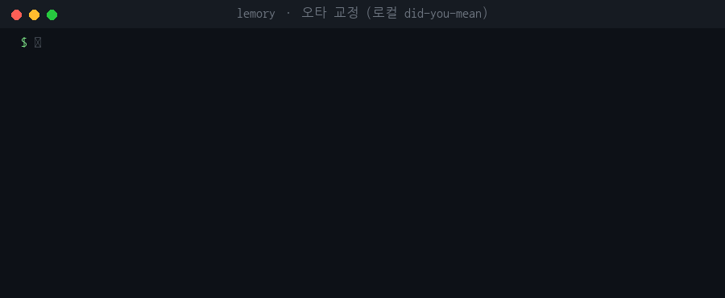
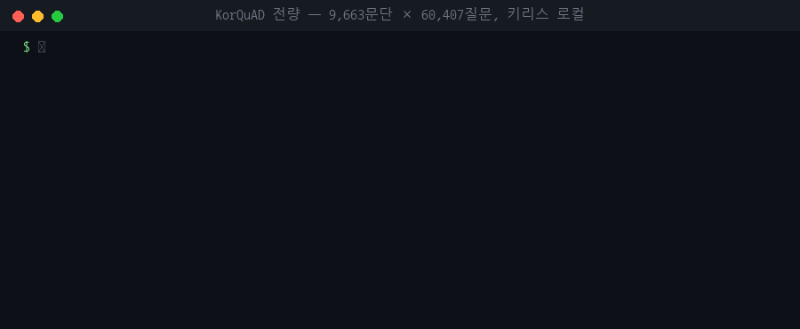

<div align="center">

# 🍋 Lemory

### 기억은 당신 것이어야 하니까요.
**남의 데이터베이스가 아니라, 내 폴더 안의 마크다운 파일로.**
<sub>Your memory should belong to you · **[English README](README.en.md)**</sub>

[](https://github.com/jwgo/lemory/actions)
[](LICENSE)
[](pyproject.toml)
[](BENCHMARKS.md)
[](benchmarks/data/kormapleqa/README.md)


<sub>목업이 아니에요. 나무위키 실제 문서 1,469개(청크 약 42,000개) 볼트에서
한국어 질문이 0.1초 만에 답변되고, 오타는 API 없이 고쳐지는 장면이에요.
[`benchmarks/`](benchmarks/)로 직접 재현할 수 있어요.</sub>

</div>

---

**Lemory는 내 마크다운 노트를 위한 로컬 메모리 미들웨어예요.** 내 노트와
내가 쓰는 AI(Claude Desktop, Claude Code, Cursor, 직접 만든 스크립트) 사이에
있으면서, 내가 적어둔 건 AI가 기억해내게 하고, 기억할 만한 건 내 소유의
마크다운 파일로 남겨요.

- **AI가 기억을 꺼내요.** 의미 검색 + 한국어에 강한 키워드 검색 +
  `[[위키링크]]` 그래프를 합친 하이브리드 검색이에요. 돌릴 수 있는 경쟁
  제품은 전부 같은 조건에서 측정했고, 지는 항목도 그대로 공개해요.
- **AI가 기억을 남겨요.** 결정이나 사실이 볼트 안의 평범한 `.md` 노트로
  저장돼요. 중복이면 표시해 주고, 관련 기억은 위키링크로 이어줘요.
  옵시디언에서 보이고, 깃으로 관리되고, `rm` 한 번이면 지워져요. 전용
  저장소도, 내보내기 버튼도, 이사 비용도 없어요.
- **뭐가 오갔는지 다 보여요.** 대시보드에 모든 질의, AI가 쓴 모든
  노트(클릭 한 번으로 되돌리기), 클라이언트별 사용량이 남아요. 전부 내
  컴퓨터의 SQLite 파일 하나예요.

> **Lemory를 "거쳐야만" 하는 건 아무것도 없어요.** 볼트는 그냥 파일이에요.
> 늘 하던 대로 노트를 쓰면(옵시디언이든, 아무 편집기든) 워처가 1초 안에
> 색인해요. `save_memory`와 `lemory remember`는 *AI가* 쓸 때 출처 표시,
> 중복 검사, 되돌리기 버튼을 붙이기 위한 통로일 뿐이에요. 문지기가 아니라
> 손님용 입구예요.

요즘 메모리 제품들은 내 지식을 *자기들* 데이터베이스에 넣고 싶어 해요.
저희 생각은 달라요. 내가 이미 가진 파일이 더 좋은 데이터베이스이고, 그래서
정확도가 떨어지지 않는다는 걸 벤치마크로 증명하는 데 시간을 썼어요.
측정해 보니 오히려 반대였어요.

## 증거부터 보여드릴게요

모든 수치는 커밋된 코드와 공개 데이터로 다시 만들 수 있어요. 방법, 지는
항목, 아직 못 푼 문제까지 [BENCHMARKS.md](BENCHMARKS.md)에 있어요.

<div align="center">


</div>

## 같은 질문을 실제 도구 3개에 던져봤어요

<div align="center">

</div>

같은 볼트에서 [tobi/qmd](https://github.com/tobi/qmd)와 MemPalace를 실제로
돌린 장면이에요. qmd는 키워드를 전부 포함해야만 찾는 방식(AND)이라 한국어
자연어 질문에 0건이 나와요. MemPalace는 영어 위주 임베더라 한국어 키워드
경로가 없어요. Lemory는 정답 노트를 1위로, 0.1초에, LLM 호출 없이 찾아요.

qmd가 로컬 LLM을 총동원해도(질의 확장 + 리랭크) 같은 329문항에서 Lemory의
LLM 없는 검색보다 낮아요. 그러면서 질문 하나에 59.5초가 걸려요:

<div align="center">

</div>

깃허브 스타가 가장 많은 메모리 레이어 mem0와도 같은 데이터, 같은 모델로
끝까지 비교했어요:

<div align="center">

</div>

## 명령 한 줄이면 시작돼요

```bash
pipx install "git+https://github.com/jwgo/lemory"
lemory up ~/Obsidian/MyVault     # 설정 → 색인 → 대시보드까지 한 번에
lemory ask "요새 내가 하던 그 프로젝트 어디까지 했지?"
```

입구는 `lemory up` 하나예요. 알아서 최적 모드를 골라요. Gemini 키가 있으면
클라우드로, 없으면 **기본 탑재된 온디바이스 스택**(한국어 특화
e5-small-ko-v2 임베딩 + Gemma 4 답변)으로 돌아요. 키도, 데몬도, 설정도
필요 없어요. 그냥 `lemory up`만 치면 볼트 위치를 물어봐요. 모델과 검색
설정은 대시보드 **설정** 탭에서 바꿔요.

그다음엔 **`lemory serve`만 켜두면 돼요.** 옵시디언 플러그인, Claude/MCP,
웹 대시보드가 전부 여기에 붙고, 노트를 고치면 몇 초 안에 다시 색인돼요.
`lemory ask "..."` 한 줄은 서버 없이도 돼요. 언제 켜두고 언제 재색인하는지는
[가이드](docs/GUIDE.ko.md)에 있어요.

색인할 때 LLM이 아예 안 돌아요. **노트 1,000개 색인 = LLM 호출 0회**,
몇 초면 검색이 돼요. 노트 54개에 LLM 그래프 만드느라 45분씩 쓰는 제품들과
비교하면요:

<div align="center">

</div>

**처음이라면 여기부터: [docs/GUIDE.ko.md](docs/GUIDE.ko.md) · 매일 쓰는 법:
[docs/ROUTINE.ko.md](docs/ROUTINE.ko.md) (English: [docs/GUIDE.md](docs/GUIDE.md))**

## 어떤 AI에게든 기억을 줄 수 있어요

```bash
claude mcp add lemory -- lemory mcp --vault ~/Obsidian/MyVault --client claude-desktop
lemory skill install claude-code    # 잘 쓰는 법까지 가르치기
```

| 클라이언트 | 설정 |
|---|---|
| Claude Code / Desktop | `claude mcp add lemory -- lemory mcp --vault <vault> --client claude-code` |
| Cursor | `.cursor/mcp.json`에 추가: `{"lemory": {"command": "lemory", "args": ["mcp", "--vault", "<vault>", "--client", "cursor"]}}` |
| Windsurf / VS Code / Codex CLI / 다른 MCP 클라이언트 | 같은 명령: `lemory mcp --vault <vault> --client <name>` |
| 스크립트 / 직접 만든 에이전트 | REST + `X-Lemory-Client` 헤더 (아래 참고) |

`--client`에 적은 이름이 대시보드 사용량에 그대로 떠요. 누가 내 기억을
읽고 쓰는지 항상 알 수 있어요.

툴은 11개예요. 읽기: `search_notes` · `ask_notes` · `recent_notes` ·
`read_note` · `list_notes` · `related_notes` · `suggest_links`(아직 연결
안 된 언급을 문장 증거와 함께 링크로 제안) · `vault_status` ·
`vault_context`(최근 활동·자주 쓰는 노트·태그를 한 번에 요약, LLM 없이
수 ms). 쓰기: `save_memory`(저장하면서 중복 검사와 관련 노트 연결까지) ·
`append_note`(덮어쓰기 불가, 볼트 밖으로 못 나감).

### 세션 기억은 자동으로 남겨요 (명령 하나)

```bash
lemory hooks install claude-code
```

이제 Claude Code 세션이 끝날 때마다 기억할 만한 결정·사실·미결 사항이
**날짜 붙은 노트 하나**로 볼트에 저장돼요. 부지런할 필요가 없어요. 다른
훅 기반 도구들과 달리, 저장된 건 전부 대시보드 피드에 출처와 되돌리기
버튼과 함께 떠요. 수동으로 관리하고 싶다면 `CLAUDE.md`에 이렇게 적어도
돼요:

```markdown
세션 시작 시 lemory의 vault_context를 한 번 불러 상황을 파악해라. 결정이나
기억할 사실, 선호가 정해지면 save_memory로 저장해라(간결하게, 노트당 기억
하나). 내 노트가 이미 답하는 것은 나에게 묻기 전에 search_notes로 검색해라.
```

**프라이버시는 파일 속성이에요.** 노트 맨 위에 `lemory: false` 한 줄만
적으면 그 노트는 색인도, 검색도, 어떤 모델로도 전송되지 않아요. 이미
색인됐던 노트라면 이 한 줄이 빼줘요.

## 한 번 말하면, 기억해요

<div align="center">

</div>

비서는 대화하면서 **읽고 써요**. "…라고 기억해줘"라고 말하면 그 자리에서
노트로 저장돼요(승인제를 켰다면 대기열로 가요). "그건 언제였지?" 같은 후속
질문은 앞 질문과 묶어서 찾아요. 첫 대화엔 볼트 상황 요약이 자동으로
들어가고, `/검색` `/기억` `/최근` 명령도 쓸 수 있어요.

비서와 나눈 대화는 `chats/` 폴더에 날짜 붙은 노트로 자동 저장돼요.
열어보고, 고치고, 지울 수 있는 평범한 마크다운 파일이에요. 그 투명함이
곧 되돌리기 버튼이에요. 한 달 뒤에 "내 여동생 이름 뭐랬지?"라고 물으면
출처와 함께 수 ms 만에 돌아와요. 위에 얹을 수 있는 선택 기능 두 가지:

- **`lemory distill`**: 원할 때만 돌리는 후처리예요. 온디바이스 Gemma가
  대화를 팩트 요약 노트로 정리하고 출처를 [[위키링크]]로 남겨요. 지저분한
  채팅 벤치 실측으로 1위 정답 존재율 +3.1%p. 한계까지
  [BENCHMARKS §7e](BENCHMARKS.md)에 있어요.
- **스킬**(`lemory skill install`)은 외부 어시스턴트에게 같은 습관을
  가르쳐요. 세션이 끝나기 전에 `lemory remember`로 저장하라고요.

업무 비서 쪽도 따로 측정했어요. **AgentMemQA**([§7f](BENCHMARKS.md))는
12주치 업무 세션(영한 혼용 기술 대화, 코드블록, 에러 로그)에 "번복된
결정" 함정을 심은 벤치마크예요. 키 없이 doc@1 **0.978**, 번복 함정에 속은
비율 **0**. 반대 발견도 그대로 적었어요. 리랭커(재정렬 AI)는 시간 개념이
없어서 갱신된 사실을 옛 값으로 되돌려요(0.80→0.50). 시간 보정을 붙여도
안 됐고요. 그래서 기본으로 꺼져 있어요.

지저분한 실전 채팅도 가정이 아니라 측정이에요. RoleMemQA-messy가
번복·농담·잡담 오염을 심었고, 전체 doc@8 0.977 · 에피소드 회상 doc@8
0.875(정보량 prior 전 0.792). 에피소드 질문("우리 약속이 뭐였지?")은
어휘 변별력이 0이라, 그런 질문에서만 벡터 레그를 희소 내용 정보량으로
재정렬해 필러("기억해 둘게, 약속!")가 아니라 진짜 팩트를 올려요. 참조형
질문(KorQuAD·AgentMemQA)엔 게이트가 안 걸려 수치가 그대로예요. 개선/후퇴
내역 전체가 [§7e](BENCHMARKS.md)에 있어요.

## 로그 파일이 아니라 두 번째 뇌예요

<div align="center">

</div>

사람이 쓴 노트에는 아래 장치가 하나도 필요 없어요. 파일을 볼트에 넣으면
다음 질문부터 바로 검색돼요. 아래 기능들은 *기계가* 쓰는 노트를 위한
거예요.

- **`save_memory`는 정리하면서 저장해요.** 새 기억이 들어올 때마다 볼트가
  이미 아는 것과 비교해요. 거의 같으면 `possible_duplicate_of:`로 표시하고,
  관련 있으면 `related:` 위키링크로 이어요. 지우고 다시 쓰는 방식(mem0식)
  대신, 연결만 하고 결정은 당신에게 남겨요.
- **`lemory suggest-links`**: 서로를 언급하는데 연결은 안 된 노트들을
  근거 문장과 함께 알려줘요. LLM 없이, 색인이 이미 만든 그래프를 읽을
  뿐이에요.
- **`lemory graph`**: 볼트 전체를 인터랙티브 HTML 한 장으로 내보내요.
  노트 1,469개, 간선 24,850개가 약 1초. 요즘 그래프 도구들은 같은 걸
  만드는 데 파일마다 LLM을 돌려요.
- **`lemory drift`**: "내 기억이 아직 현실과 맞나?"를 확인해요. 깨진
  링크, 사라진 파일, 방치된 중복 표시를 찾고, `--prompt`를 붙이면
  에이전트한테 그대로 넘길 수리 지시문으로 만들어줘요. 토큰 0개.
  (이 아이디어를 개척한 [mex](https://github.com/mex-memory/mex)에
  고마움을 전해요.)
- **`lemory conflicts`**: "내 기억끼리 서로 맞나?"를 확인해요. 거의 같은
  말인데 숫자가 다르거나, 서로 부정하거나, 아예 중복인 노트 쌍을 찾아요.
  이미 있는 색인 위에서 코사인으로 찾으니 LLM 0회. (`drift`가 기억 대
  현실이라면 `conflicts`는 기억 대 기억이에요.)
- **`lemory search --fast`**: 즉답 경로예요. 임베딩 없이 키워드 검색 +
  오타 교정 + 제목/최신성 부스트만으로 3.8ms에 recall@1 0.975
  (하이브리드는 21ms에 0.967이에요. 말 바꿔 묻기, 다른 언어, 멀티홉엔
  벡터가 필요해서 기본은 하이브리드예요). 타이핑 즉시 검색창용이에요.
- **시간을 이해해요.** "요새 내가 하던 그거 뭐였지?"엔 최신 사실을,
  "3월에 읽던 책은?"엔 그때 기록을 찾아와요.

AI가 쓴 건 전부 대시보드 **AI 메모리 피드**에 "누가 썼는지"와 되돌리기
버튼과 함께 떠요(되돌리면 옵시디언 휴지통 `.trash`로 가요. 사람이 쓴
노트는 아예 되돌리기 대상이 아니에요). 모든 질의도 출처와 함께 남아요.
이게 미들웨어의 약속이에요. 아무것도 몰래 지나가지 않아요.


## 데모 모음, 전부 실제로 돌아가는 화면이에요

각 클립은 작은 한국어 데모 볼트에서 **실제 CLI 출력을 글자 그대로** 다시
찍은 거예요. 재생성 스크립트는 `docs/assets/make_gifs.py`에 있고, 캡처
원문도 스크립트 안에 있어요. 목업은 없어요.

| | |
|---|---|
| **즉답 검색** `--fast` · 임베딩 0회, 3.8ms<br> | **모순 탐지** `lemory conflicts` · 기억 vs 기억<br> |
| **AI 쓰기 승인** pending → approve<br> | **드리프트 감지** `lemory drift` · 기억 vs 현실<br> |
| **범위 연산자** `tag:` `folder:` `path:`<br> | **시간 인지** "요새 작업하던…" → 최신 결정 1위<br> |
| **오타 교정** FoundatoinDB → FoundationDB<br> | **대규모 검증** KorQuAD 9,663문단 × 60,407질문<br> |

## 대시보드

`lemory serve` → `127.0.0.1:8377`. 옵시디언을 또 만든 게 아니라,
*미들웨어에 뭐가 오갔는지* 보는 화면이에요.

- **현황**: 타임라인이에요. AI 메모리 피드(되돌리기 포함), 최근 질의와
  출처, 클라이언트별 사용량, 색인 활동을 볼 수 있어요.
- **지식**: 노트 하나하나의 상세예요. 색인된 청크, 들어오고 나가는 링크,
  옵시디언 그래프에 없는 '언급' 간선까지 보이는 로컬 그래프, 관련 노트요.
- **건강**: 승인 대기 기억, 모순 쌍, 드리프트, 링크 제안을 한 화면에서
  처리해요.
- **검색**: 하이브리드/벡터/키워드를 바꿔가며 점수와 속도를 볼 수 있는
  실험실이에요.
- **설정**: 검색 옵션을 바로 적용해요. 타임라인 기록 여부도 설정이고
  (`event_log`), 전부 내 SQLite 파일에만 남아요.


## 파일 vs 행: 개인 지식에는 파일이 이겨요

Lemory와 가장 비슷한 건 mem0의 OpenMemory(대시보드 있는 로컬 MCP
메모리)예요. 차이는 "기억"이 *무엇이냐*예요.

| | **Lemory** | OpenMemory (mem0) | supermemory 셀프호스트 | basic-memory | qmd |
|---|---|---|---|---|---|
| 기억이란 | **내 마크다운 파일** | Postgres+Qdrant의 행 | 전용 저장소의 레코드 | 마크다운 파일 | (읽기 전용 인덱스) |
| 실행 형태 | 프로세스 1개, SQLite 1개 | Docker: Postgres + Qdrant + UI | 바이너리 + 외부 임베딩 | pip 패키지 | bun CLI |
| 기존 노트를 읽나 | **네, 그게 존재 이유** | 아니요 (대화에서 추출) | 업로드 | 부분적 | 네 |
| 색인 LLM 호출 | **0** | 대화마다 | API 쪽 | 0 | 0 |
| 대시보드 | 타임라인 + 되돌리기 + 클라이언트 | 기억 CRUD UI | 콘솔 | 없음 | 없음 |
| 검색 (직접 측정) | **멀티홉 1.000 · 약 3ms** | 0.579 · 212ms | 0.579 · 327ms | 측정 불가¹ | 0.526 · 0.6~59초 |
| 한국어 검색 | **CJK 바이그램 + 오타 교정** | 영어 우선 | 영어 우선 | 영어 우선 | 영어 우선 |
| 떠날 때 비용 | 없음, 파일이 남아요 | 내보내기/이사 | 내보내기/이사 | 없음 | 없음 |

<sub>¹ basic-memory는 그래프 탐색 중심이라 순위 검색이 없어요. 측정된
수치는 전부 같은 조건, 같은 모델, 같은 데이터: [방법론](BENCHMARKS.md).</sub>

추출 방식(행)의 기억은 내 말의 *요약*이에요. 저장할 때 정보가 깎이고,
나중에 검증할 수 없어요. 파일 방식은 실제 노트를 날짜와 맥락 그대로
가져와요. 검색 품질을 측정할 수 있는 것도 그 덕분이에요.

## 합성 데이터가 아니라 실제 데이터로 증명해요

**사람들이 실제로 묻는 방식대로**: 말 바꿔 묻기, 영어 노트에 한국어 질문,
키워드만 던지기, 오타까지 (full-support@8):

<div align="center">

</div>

**멀티홉, LLM 그래프 진영과의 대결.** 내 `[[위키링크]]`와 제목 언급이
이미 지식그래프예요. 그걸 공짜로 읽는 쪽이, LLM 파이프라인으로 그래프를
만드는 쪽보다 높게 나왔어요:

<div align="center">

</div>

| | **Lemory** | LightRAG | MemPalace | mem0 | cognee | supermemory | LlamaIndex | qmd |
|---|---|---|---|---|---|---|---|---|
| 멀티홉 answer-in-context@8 | **1.000** | 0.807¹ | 0.596 | 0.579 | 0.561 | 0.579 | 0.649 | 0.526 |
| 2-hop 질문만 | **1.000** | 0.738 | 0.452 | 0.548 | 0.405 | - | 0.524 | 0.381 |
| 색인, 54노트 | **LLM 0회, 약 30초** | 165회, 14분 | 로컬 임베딩 | 노트당 1~2회 | 약 45분 | API 쪽 | 0 | 0 |
| 검색 지연 (p50) | **약 3ms** | 7.5초² | 약 1초³ | 212ms | 약 5초 | 327ms | 649ms⁴ | 0.6~59초 |
| 한국어 질문 (full-support) | **0.950** | - | 0.350 | - | - | - | - | - |

<sub>¹ LightRAG에 유리하게 채점했어요. 병합된 컨텍스트 덩어리가 다른
시스템의 8청크보다 커요. LLM으로 만든 그래프는 진짜고 경쟁 최고 2-hop
점수지만, 색인에도 질의에도 LLM 비용을 내요. ² 무료 티어 제한 하의 질의당
LLM 호출 포함, 유료면 1~2초. ³ 프로세스 기동 포함 실측, 그들이 내세우는
zero-API 구성. ⁴ 질의마다 API 임베딩, 캐시 없음. 로컬 전용이면 약 2ms.</sub>

**업계 표준 메모리 벤치마크도요.** LongMemEval_S 전체 500문항, API 호출 0,
로컬 임베더만으로:

<div align="center">

</div>

다들 헤드라인에 쓰는 기준으로 Recall@5 **0.983**. 그리고 더 엄격한
전-증거 기준(0.904)을 앞에 세워요. 유리한 숫자만 골라 쓰지 않아요.
LOCOMO LLM 채점 0.706 vs mem0 공개 수치 0.669, DMR(500문항) 0.694 vs 같은
조건 naive RAG 0.668이에요 ([§7b](BENCHMARKS.md)).

**롤플레잉 기억, 캐릭터 챗에 진짜 필요한 축.** 직접 만들어 공개한
**RoleMemQA**([§7e](BENCHMARKS.md)): 8명의 페르소나 × 30세션, 단기/장기/
에피소드/취향 변경/시간/2홉/거절까지 144문항(정답은 코드로 검증). 키 없이
**doc@1 0.977**, 취향이 바뀐 질문 1.000에 옛 취향 함정에 속은 비율 **0**.
자기 벡터(0.938)·키워드(0.820) 경로를 모두 이기면서 약 1ms예요. 이 벤치가
잡아낸 실제 결함 2개도 바로 고쳤어요.

**[KorQuAD 1.0](https://korquad.github.io/)**: 실제 한국어 위키피디아
140개 문서, 사람이 쓴 질문 400개, 키 없이 로컬로:

| System | Recall@1 | Recall@5 | MRR@10 |
|---|---|---|---|
| **Lemory** (hybrid+graph) | **0.930** | 0.980 | **0.951** |
| BM25 | 0.900 | **0.985** | 0.937 |
| Vector-only RAG | 0.840 | 0.953 | 0.887 |

<sub>이 표는 오랫동안 BM25가 이겼고, 저희는 그동안 그 사실을 그대로
실었어요. 2026년 7월 한국어 검색 개선이 드디어 뒤집었어요. 400문항 표본은
동점 처리에 따라 ±2문항 흔들려요. 그래서 10배(4,000문항)로도 측정했고,
현재 코드가 r@1 0.9795로 앞서요(BENCHMARKS §7e). 옛 표는 깃 히스토리에
있고, 실전에서 중요한 숫자는 위의 강건성 차트예요.</sub>

**[KorMapleQA](benchmarks/data/kormapleqa/README.md)** 는 저희가 만들어
돌려드리는 기여예요. 실제 나무위키 메이플스토리 문서 1,469개 위의
2,075문항. 100% 코드로 만들고 기계로 검증해서 API 키 없이 재현되고, LLM이
쓴 질문 특유의 편향이 없어요.

저희가 만들지 않은 실제 볼트도 있어요. 옵시디언 CEO Steph Ango의 공개
볼트와 공식 Obsidian Help 볼트요 ([§5d](BENCHMARKS.md)).

## 한국어가 1등 시민이에요

이 분야 대부분은 한국어를 나중 일로 미뤄요. Lemory는 벤치마크로 다뤄요.

- **한글 + 가나 + 한자 바이그램 색인**: 조사가 붙은 어절,
  `ナイトロード나이트로드` 같은 혼합 표기까지 전부 찾아요. 보통의
  토크나이저는 이걸 못 찾는 한 덩어리로 붙여버려요.
- **음절 단위 오타 교정**: `메플이스토리`로 메이플스토리를 찾아요. 옆
  글자끼리 바뀐 오타를 편집 1회로 계산해요. 한국어 오타가 실제로 나는
  방식이거든요.
- **활용을 아는 인용 감지**: `만든`으로 `만들었다`를 찾아요. 자모 수준
  어간 매칭이 활용, ㄹ탈락, 띄어쓰기 차이를 버텨요.
- 영어 노트에 한국어로 물어도 0.950. BM25는 0.250, MemPalace는 0.350이에요.

## 이런 게 돼요

```
$ lemory ask "3분기 킥오프에서 예산 얼마로 잡았지?"                 # 회의록
$ lemory ask "데이터플랫폼팀 리드가 누구고 무슨 일 하는 팀이지?"      # 조직/사람
$ lemory ask "재택근무 정책, 작년이랑 지금이랑 뭐가 달라졌지?"        # 시간 축 비교
$ lemory ask "자바스크립트 이벤트 루프 뭐였지? 내 노트 기준으로"      # 공부 노트
$ lemory ask "카오스 벨룸 가기 전에 준비물 뭐라고 적어놨더라?"        # 게임 노트
$ lemory ask "오사카에서 갔던 그 라멘집 이름이 뭐였지?"              # 여행 기록
```

일반 RAG가 구조적으로 못 하는 것들:

```
$ lemory ask "프로젝트 아틀라스 리드가 좋아하는 DB가 뭐더라?"
# 멀티홉: 아틀라스 노트 → [[리드]] 링크 → 그 사람 노트에 답이 있어요

$ lemory ask "요새 내가 읽던 책 뭐였지?"
요즘 읽는 책은 어스시의 마법사이다 [1, 3].     # 시간: *지금* 책
$ lemory ask "3월에 읽던 책은?"                # 3월을 물으면 그때 기록으로

$ lemory search "tag:회의록 folder:2026 예산"   # 범위 연산자, 전 모드
$ lemory remember "VPN 갱신은 매년 3월, 담당 김하늘" --tags ops   # CLI에서 기억 남기기
$ lemory import-chats conversations.json        # ChatGPT/Claude 대화 → 검색되는 노트
$ lemory connect ./my_source.py                 # 커넥터 SDK: 어떤 소스든 → 볼트 노트
$ lemory agents install                         # AGENTS.md 생성, 어떤 에이전트든 볼트를 기억으로
$ lemory graph --open                           # 볼트 전체를 인터랙티브 그래프로
$ lemory context                                # 에이전트용 볼트 요약 한 번에
```

오타는 내 볼트의 단어들을 기준으로 고쳐져요(API 없음). 이름 변경, 삭제,
별칭, 한국어 파일명도 워처가 실시간으로 따라가요. `default_scope`를
설정하면 모든 질문이 기본으로 그 폴더/태그 안에서 돌고(`scope:all`로 한
번만 해제), 질문에 연산자를 직접 쓰면 그게 항상 우선이에요.

## 왜 잘 되나요: 마법이 아니라 구조예요

- **멀티홉 1.000 vs 0.53~0.81 (전원)**: 검색이 링크를 따라 1홉
  확장하는데, 질의 유사도와 키워드 증거 둘 다 확인하고, 직접 증거보다
  높아지지 않게 눌러둬요. 색인할 때 LLM 없이 미리 캐놔요.
- **강건성 0.95+ vs 0.25~0.67**: 벡터와 키워드는 *다르게* 실패해요.
  가중 융합이 둘을 덮어요. 질문이 노트를 거의 그대로 인용하면 키워드
  순위를 그대로 고정해요(핀). 순위만 섞는 융합은 확실한 키워드 우위를
  존중할 수 없거든요.
- **초가 아니라 밀리초**: 전부 한 프로세스, SQLite FTS5 + numpy. 청크
  2만 개를 넘으면 IVF-int8 인덱스로 자동 전환돼요. **청크 100만 개에서
  5.9ms/질의, 정확 검색 대비 recall 1.000, RAM 732MB**
  ([§12b](BENCHMARKS.md)). SQLite를 다른 걸로 바꾸는 실험도 했고 왜 안
  바꿨는지 공개했어요 ([보고서](docs/STORAGE.md)).
- **비용은 0에 수렴해요.** 임베딩 캐시, Gemini 무료 티어로 하루 약
  250질문, 그리고 바이트 하나 못 나가는 망분리 환경을 위한 완전
  온디바이스 모드까지요.

## 개발자라면

```python
import lemory
lemory.configure(vault="~/Obsidian/MyVault")
lemory.index()
print(lemory.ask("가격 정책 뭐라고 결정했더라?").text)
```

TypeScript/Node는 의존성 0인 클라이언트가 [`clients/js`](clients/js)에
있어요: `new Lemory({client: "my-agent"}).search(...)`.

파이썬 프레임워크에는 그대로 끼워 넣으면 돼요(둘 다 실제 프레임워크로
테스트했어요):

```python
from lemory.integrations.langchain import LemoryRetriever     # langchain-core
from lemory.integrations.llamaindex import LemoryLlamaRetriever  # llama-index-core
```

셀프호스팅: `docker build -t lemory . && docker run -p 127.0.0.1:8377:8377
-v ~/vault:/vault lemory`. 뭔가 이상하면 `lemory doctor`가 볼트, 인덱스,
FTS5, 임베더, 생성기를 한 번에 점검해요. 그 출력을 이슈에 붙여주세요.

[Cerebras의 사내 지식베이스 글](https://www.cerebras.ai/blog/how-we-built-our-knowledge-base)에서
가져온 것도 출처를 밝혀요. **랭킹 후 이웃 복원**: 순위가 정해진 뒤 각
청크에 앞뒤 문맥을 다시 붙여, 잘려나간 전제와 주의사항을 되살려요
(`context_neighbors`). **대화 버스트 청킹**: 같은 화자의 연속 발화 중
알맹이 있는 것만 골라 따로 색인하되, 융합에서는 자기 노트의 순위를 올리는
역할만 해요(실측 내역 전체가 §7e에 있어요). 그들의 나머지 핵심 설계는
Lemory가 이미 만들어 측정한 것들이었어요.

격차 분석으로 추가된 것들: `lemory ask --deep`(어려운 질문을 쪼개서 각각
검색 후 증거 병합), `lemory backup`/`restore`, `index_docx = true`(Word
텍스트 추출), `lemory connect`(커넥터 SDK), `default_scope`(기본 검색
범위), 그리고 **모바일**: `lemory serve --host 0.0.0.0` + `api_token`이면
폰에서도 토큰 인증으로 붙고, localhost는 그대로 무설정이에요.

실패한 실험도 정책대로 공개해요. **시맨틱 폴백 링크**(링크 없는 노트에
유사도 간선)는 만들었고, 측정했고, **효과가 없다는 게 확인돼** 기본으로
꺼뒀어요. **리랭커의 시간 보정**도 실제 모델로 3팔 비교(끔 0.978 / 켬
0.889 / 켬+보정 0.867)한 뒤 되돌렸어요. 이득만 남기고 실패는 기록해요.

REST는 `lemory serve`에: `GET /search` · `POST /ask` · `GET /context` ·
`POST /memory` · `POST /append` · `POST /memory/trash` · `POST /index` ·
`GET /status`, 대시보드 API(`/api/events`, `/api/clients`, `/api/notes`,
`/api/related`, ...)도 있어요. `X-Lemory-Client` 헤더로 정체를 밝히면
대시보드에 출처가 표시돼요.

옵시디언 사이드바 플러그인(파일 3개 복사면 설치 끝), PDF 색인
(`pip install 'lemory[pdf]'`, `index_pdf = true`), 검색 옵션 전체는
[`lemory.toml`](docs/GUIDE.ko.md), 깊은 이야기는
[BENCHMARKS.md](BENCHMARKS.md) · [docs/STORAGE.md](docs/STORAGE.md) ·
[docs/COMPETITIVE.md](docs/COMPETITIVE.md)에 있어요.

## 어떻게 돌아가나요

```
 내 볼트 (*.md) ──감시──► 파싱: frontmatter · 태그 · [[링크]] · 날짜
                                 │
                                 ▼
              SQLite 파일 하나: 청크 · BM25 · 링크 그래프 · 임베딩 캐시
                              + 이벤트 타임라인      + IVF-int8 (큰 볼트)
                                 │
 질문 ─► 오타 교정 ─► 벡터 + 키워드 (융합) ─► 제목·최신성 부스트
                                 │
                        1홉 그래프 확장   ← 멀티홉 답이 여기서 나와요
                                 │
                                 ▼
              날짜와 출처가 붙은 컨텍스트 ─► LLM ─► 답변 [n]

 save_memory ─► 중복 검사 ─► 볼트 안의 .md ─► 다음 질문부터 검색돼요
```

검색은 로컬이고 LLM이 없어요(3~13ms). 질문당 임베딩 1회(캐시됨),
`ask()`당 생성 1회예요.

## 정직하게 말하면

- 문서를 그대로 인용하는 질문은 오랫동안 순수 BM25가 유리했어요. 저희는
  그게 사실인 동안 그대로 실었어요. 2026년 7월에 뒤집혔고, 옛 수치는 깃
  히스토리에 있어요.
- qmd의 간판 모드에서도 이제 품질까지 앞서요(동일 문항 0.875 vs 0.769).
  예전 임베더로는 동률이었어요. 약 3,700배의 속도 차이는 원래부터
  있었고요.
- kepano의 작은 영어 볼트에선 벡터 단독이 한 문제 차로 저희를 이겨요.
  BENCHMARKS에 그렇게 적혀 있어요.
- 청크 4만 2천 개 코퍼스의 2-hop full-support는 측정한 전원에게 어려워요.
  저희 로컬 수치는 0.477로 올라왔지만, 상시 도전 과제로 남겨뒀어요.
- 타 팀의 공개 수치는 다른 생성기/채점 기준이라 참고로만 인용해요. Zep의
  DMR 94.8은 GPT-4급 구성이고, 이겼다고 말하지 않아요.
- SQLite를 바꾸는 실험(DuckDB, LanceDB)에서 LanceDB의 텍스트 검색이 최악
  케이스에서 진짜로 5배 빨랐어요. 그걸 공개하고도 SQLite에 남아요. 나머지
  네 항목은 SQLite가 이겨요 ([전체 보고서](docs/STORAGE.md)).
- 버스트 청킹의 후퇴도 기록에 있어요. 깨끗한 노트 1문항, 번복 함정
  1문항이요. 고치려던 패치가 다른 함정을 무너뜨려서 접었고, 이득과 후퇴를
  함께 공개했어요 (§7e).

## 로드맵

- [ ] PyPI (`pip install lemory`) · [ ] 옵시디언 커뮤니티 플러그인 등록
- [x] AI 쓰기 경로 + 되돌리기 있는 타임라인 · [x] 클라이언트 출처 표시
- [x] 기억 정리 (중복 표시 + 관련 링크)
- [x] 링크 제안 · [x] 인터랙티브 그래프 · [x] 어시스턴트 스킬
- [x] PDF 색인 · [x] 100만 청크 볼트용 ANN 인덱스
- [x] 채팅 가져오기 (ChatGPT/Claude) · [x] KorMapleQA 벤치마크
- [x] 커넥터 SDK (`lemory connect`) · [x] 기본 검색 범위 (`default_scope`)
- [x] 에이전트 온보딩 (`lemory agents`: AGENTS.md + 감지) · [x] AI 쓰기 git 체크포인트
- [ ] 이미지 OCR / 오디오 전사 · [ ] 웹 클리퍼
- [ ] 멀티 볼트 프로필

## 함께 만들어요

`uv venv && uv pip install -e ".[dev,mcp,local,pdf]" && pytest` 한 줄이면
테스트 400여 개가 완전 오프라인으로 돌아요. [CONTRIBUTING.md](CONTRIBUTING.md) · 한국어
이슈/PR 환영해요.

처음부터 로컬 우선으로 설계했어요. 신뢰 모델, 로컬 서버의 보안 장치,
취약점 신고 방법은 [SECURITY.md](SECURITY.md)에 있어요.

**[English README](README.en.md)** · MIT
