<div align="center">

# 🍋 Lemory

### Your memory should belong to you.
**Not rows in someone's database. Markdown files, in your own vault.**
<sub>기억은 당신의 것이어야 합니다 · **[한국어 README](README.ko.md)**</sub>

[](https://github.com/jwgo/lemory/actions)
[](LICENSE)
[](pyproject.toml)
[](BENCHMARKS.md)
[](benchmarks/data/kormapleqa/README.md)

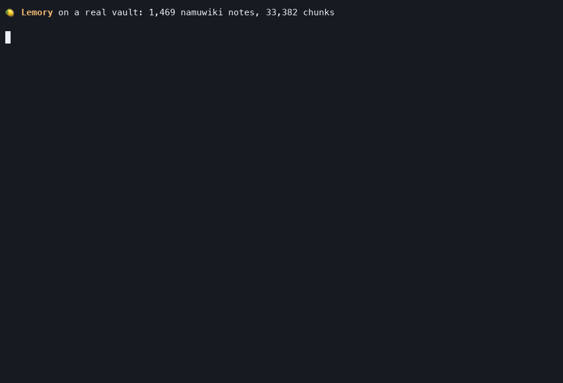

<sub>Not a mock. A real 1,469-note / 33,382-chunk namuwiki vault: a natural
Korean question answered in 13 ms of local compute, a typo repaired without
any API call. Reproducible from [`benchmarks/`](benchmarks/).</sub>

</div>

---

**Lemory is local memory middleware for your Markdown.** It sits between your
notes and every AI you use (Claude Desktop, Claude Code, Cursor, your own
scripts) so that anything you ever wrote down becomes something they can
recall, and anything worth remembering becomes a Markdown file you own.

- **AI reads your memory**: hybrid retrieval (semantic + Korean-aware keyword
  + your `[[wikilink]]` graph) that we benchmark against every competitor we
  can run, and publish the losses too.
- **AI writes your memory**: decisions and facts land as plain `.md` notes
  with duplicate detection and automatic `related:` links. Visible in
  Obsidian, versionable, greppable, one `rm` from gone. No proprietary
  store, no export button needed, nothing to migrate off of.
- **You watch the middleware**: a dashboard shows what flowed through:
  every query, every note an AI wrote (with one-click undo), per-client
  usage. All of it local, in one SQLite file.

> **Nothing has to go "through" Lemory.** The vault is just files. Write
> notes the way you always did (Obsidian, any editor, a shell script) and
> the live watcher indexes them within a second. `save_memory` and
> `lemory remember` exist so that *AI* writes get attribution, duplicate
> checks, and an undo button. They are a courtesy entrance, not a gate.

The industry's memory products want your knowledge as rows in *their*
database. We think the file you already own is the better database, and we
spent the benchmarks proving it doesn't cost you accuracy. The opposite,
measurably.

## The receipts, up front

Every number regenerates from committed code and public data. Methodology,
losses, and open problems: [BENCHMARKS.md](BENCHMARKS.md).

<div align="center">
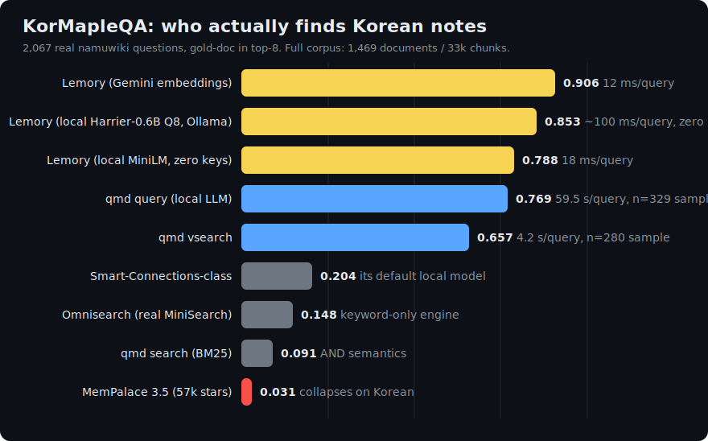
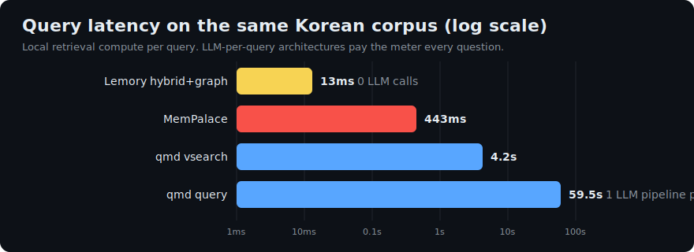
</div>

## Same question, three real tools, live

<div align="center">

</div>

That is [tobi/qmd](https://github.com/tobi/qmd) and MemPalace running for
real on the same vault, not screenshots of their docs. qmd's BM25 uses AND
semantics, so a natural Korean question returns nothing. MemPalace ships an
English-first embedder with no Korean lexical path. Lemory returns the boss
note itself as the first hit, in 13 ms, with zero LLM calls.

When qmd runs its full local-LLM pipeline (query expansion + rerank) it does
reach Lemory-level quality. It costs 59.5 seconds per query to get there:

<div align="center">
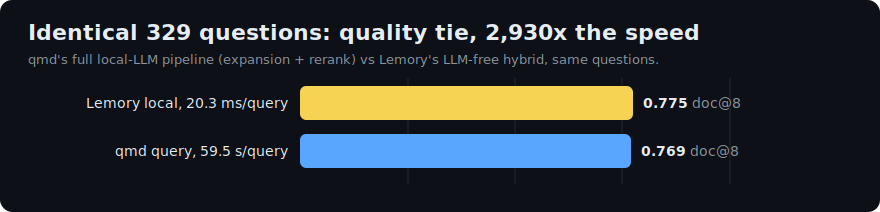
</div>

And against mem0, the most-starred OSS memory layer, same corpus and same
Gemini models end to end:

<div align="center">
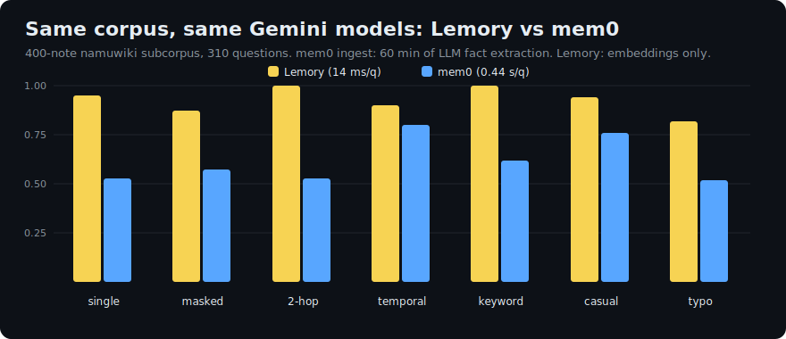
</div>

## Start with one command

```bash
pipx install "git+https://github.com/jwgo/lemory"
lemory up ~/Obsidian/MyVault     # 딸깍: detect key → pick mode → index → dashboard
lemory ask "요새 내가 하던 그 프로젝트 어디까지 했지?"
```

`lemory up` asks zero questions: it uses a Gemini key if it finds one (cloud
embeddings + answers), otherwise the **local embeddings that ship by default**
(MiniLM out of the box, or Harrier-0.6B with `pip install "lemory[llama]"`), so
semantic search works with no key and no extra setup. Prefer a guided
wizard? `lemory setup`.

Then just **keep `lemory serve` running**: it's the always-on backend for the
Obsidian plugin, Claude/MCP, and the web dashboard, and it re-indexes your
edits within seconds. One-off `lemory ask "..."` works without it. The full
day-to-day flow (when to keep it on, when to re-index) is in the
[guide](docs/GUIDE.md#4-how-to-use-it--set-up-once-then-keep-using-it).

No LLM pipeline runs at ingest either way. **Indexing 1,000 notes costs 0
LLM calls** and is searchable in seconds, not the ~45 minutes of LLM
graph-building some competitors need for a 54-note vault:

<div align="center">
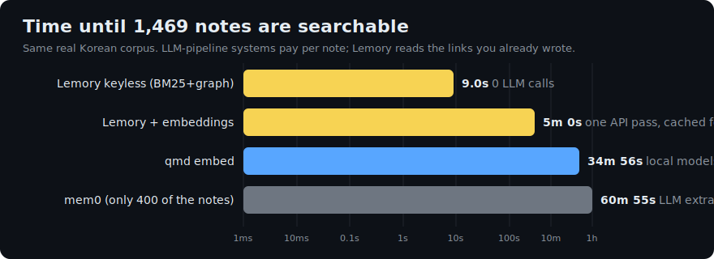
</div>

**New here? Step-by-step: [docs/GUIDE.md](docs/GUIDE.md)
(한국어: [docs/GUIDE.ko.md](docs/GUIDE.ko.md) · 루틴: [docs/ROUTINE.ko.md](docs/ROUTINE.ko.md)).**

## Give your AI a memory. Any AI.

```bash
claude mcp add lemory -- lemory mcp --vault ~/Obsidian/MyVault --client claude-desktop
lemory skill install claude-code    # and teach the assistant to use it well
```

| Client | Setup |
|---|---|
| Claude Code / Desktop | `claude mcp add lemory -- lemory mcp --vault <vault> --client claude-code` |
| Cursor | add to `.cursor/mcp.json`: `{"lemory": {"command": "lemory", "args": ["mcp", "--vault", "<vault>", "--client", "cursor"]}}` |
| Windsurf / VS Code / Codex CLI / any MCP client | same stdio command: `lemory mcp --vault <vault> --client <name>` |
| Scripts / your own agent | REST with an `X-Lemory-Client` header (below) |

The `--client` name is how each app shows up in the dashboard's per-client
usage. You always know who is reading and writing your memory.

Eleven tools (with MCP behavior annotations, so clients know what's
read-only). Read: `search_notes` · `ask_notes` · `recent_notes` ·
`read_note` · `list_notes` · `related_notes` · `suggest_links` (unlinked
mentions as [[link]] proposals with the mention's sentence) · `vault_status`
· `vault_context` (one-call session context: recent activity, hot notes,
hubs, tags; Zep-style, ~ms, zero LLM). Write: `save_memory` (with
consolidation: related existing memories get linked, near-duplicates get
flagged) · `append_note` (never overwrites, can't escape the vault).

### Automatic session memory (one command)

```bash
lemory hooks install claude-code
```

Registers a SessionEnd lifecycle hook: when a Claude Code session ends, the
decisions, facts and open threads worth keeping are summarized into **one
dated Markdown note** in your vault. No discipline required, and unlike the
hook-based memory tools, every capture lands in the dashboard feed with
attribution and one-click undo. Prefer manual control? The `CLAUDE.md`
instruction pattern still works:

```markdown
At the start of a session, call lemory's vault_context once for situational
awareness. When we settle a decision, a fact worth keeping, or a preference,
save it with save_memory (concise, one memory per note). Search the vault
with search_notes before asking me things my notes already answer.
```

**Privacy is a file property**: put `lemory: false` in any note's frontmatter
and it is never indexed, never retrieved, never sent to any model. If it was
indexed before, the flag removes it.

## A second brain, not a log file

<div align="center">

</div>

Human notes never need any of this machinery: drop a file in the vault and
it is searchable on the next query. The features below are for the notes
*machines* write.

- **`save_memory` consolidates.** Every new memory is checked against what
  the vault already knows: near-duplicates get `possible_duplicate_of:`
  frontmatter, related notes get `related:` wikilinks. mem0-style fact
  updating without the destructive rewrite. We link, you decide, and a
  wikilink is its own undo story.
- **`lemory suggest-links`** surfaces notes that mention each other but were
  never linked, with the sentence as evidence. Zero LLM: it reads the graph
  the index already built.
- **`lemory graph`** exports the whole vault as one self-contained
  interactive HTML file (force layout, folder colors, search,
  click-to-explore). About 1 second for 1,469 notes and 24,850 edges, zero
  LLM calls. The 2026 graph-tool wave needs an LLM pass per file for the
  same artifact.
- **`lemory drift`** answers "does my memory still match reality?": broken
  [[wikilinks]], links to files that no longer exist, duplicate flags nobody
  resolved. `--prompt` renders the findings as one agent-ready repair prompt.
  Deterministic, zero tokens. (Tip of the hat to
  [mex](https://github.com/mex-memory/mex), which pioneered drift detection
  for coding-agent scaffolds; mex has no ranked retrieval to benchmark, so
  it lives here as an idea we adopted rather than a row in our tables.)
- **Time awareness**: "요새 내가 하던 그거 뭐였지?" ranks the current fact
  above the superseded one that has more mentions; "3월에 읽던 책은?" still
  reaches history.

Every write shows up in the dashboard's **AI 메모리 피드** with who wrote it
and an undo button (moves the note to `<vault>/.trash`, Obsidian's own
trash; human-authored notes are refused by construction). Every query shows
up in **최근 질의** with its top sources. That's the middleware contract:
nothing passes through invisibly.

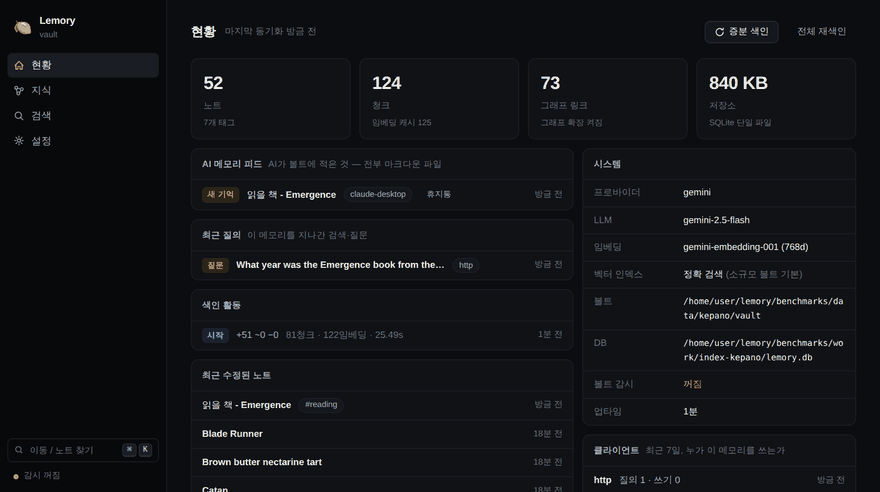

## The dashboard

`lemory serve` → `127.0.0.1:8377`. Not a second Obsidian, a view of the
*middleware*:

- **현황**: the timeline. AI memory feed (with undo), recent queries and
  their sources, per-client usage (`claude-desktop` vs `cursor` vs `cli`),
  index activity, which vector index is active
- **지식**: per-note detail. Chunks as indexed, links in/out, a local graph
  that shows the *mention* edges Obsidian's graph can't see, related notes
  by content, reference counts
- **검색**: hybrid/vector/BM25 playground with score bars and latency readout
- **설정**: retrieval knobs with live apply; the timeline itself is a
  setting (`event_log`) and all of it stays in your local SQLite file

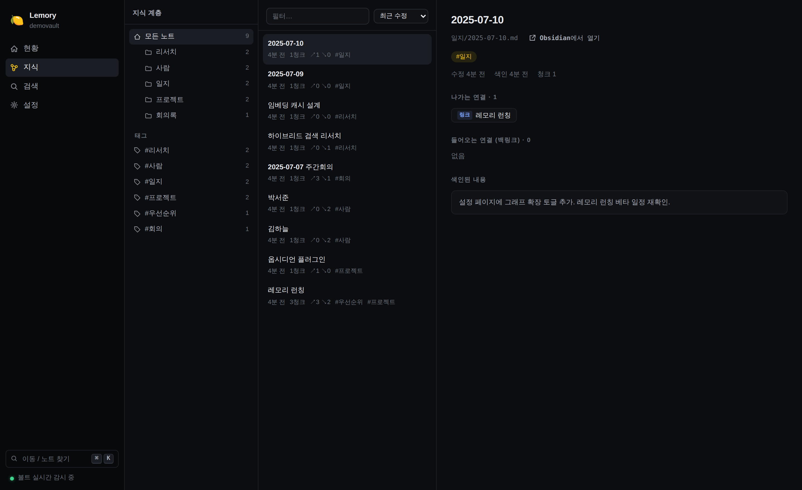

## Files vs rows: why this beats a memory API for personal knowledge

The closest thing to Lemory is mem0's OpenMemory (local MCP memory with a
dashboard). The difference is what a "memory" *is*:

| | **Lemory** | OpenMemory (mem0) | supermemory self-host | basic-memory | qmd |
|---|---|---|---|---|---|
| A memory is | **a Markdown file you own** | a row in Postgres+Qdrant | a record in its binary's store | a Markdown file | (read-only index) |
| Runs as | 1 process, 1 SQLite file | Docker: Postgres + Qdrant + UI | 1 binary + external embeddings | pip package | bun CLI |
| Ingests your existing notes | **yes, that's the point** | no (chat-extracted memories) | uploads | partially | yes |
| Ingest LLM calls | **0** | per-conversation extraction | API-side | 0 | 0 |
| Dashboard | timeline + undo + clients | memory CRUD UI | console | none | none |
| Retrieval, measured by us | **multi-hop 1.000 · ~3 ms** | mem0 OSS: 0.579 · 212 ms | 0.579 · 327 ms | not benchmarkable¹ | 0.526 · 0.6-59 s |
| Korean retrieval | **CJK-bigram FTS + typo repair** | EN-first | EN-first | EN-first | EN-first |
| Leaving costs | nothing, files stay | export/migrate | export/migrate | nothing | nothing |

<sub>¹ basic-memory is graph-navigation-first; it has no ranked retrieval to
measure. All measured numbers from the same harness, same models, same
corpus: [methodology](BENCHMARKS.md).</sub>

Extraction-based memories (rows) are *summaries of* what you said: lossy at
write time, unverifiable later. File-based memory retrieves the actual note,
with the date, in context. That's also why retrieval quality is measurable
here at all.

## Proof on real data, not our own synthetic sets

**Questions the way people actually ask them** (paraphrased, Korean question
over English notes, keyword shorthand, typos; full-support@8):

<div align="center">
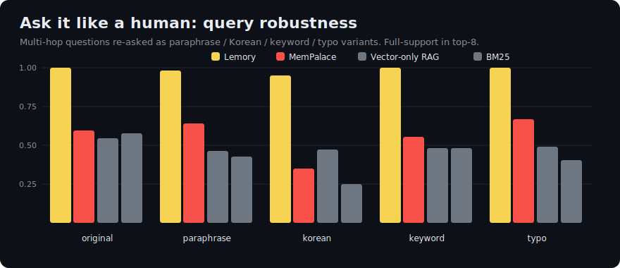
</div>

**Multi-hop, against the LLM-graph field.** Your `[[wikilinks]]` and
unlinked title mentions *are* the knowledge graph. Reading them for free
scored higher than the graphs competitors pay LLM pipelines to build:

<div align="center">
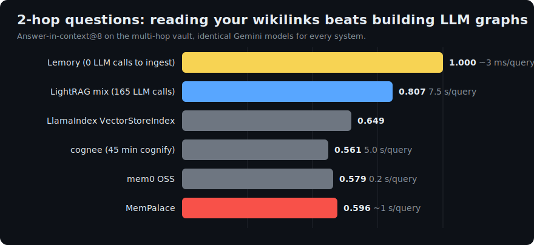
</div>

| | **Lemory** | LightRAG | MemPalace | mem0 | cognee | supermemory | LlamaIndex | qmd |
|---|---|---|---|---|---|---|---|---|
| Multi-hop answer-in-context@8 | **1.000** | 0.807¹ | 0.596 | 0.579 | 0.561 | 0.579 | 0.649 | 0.526 |
| 2-hop questions only | **1.000** | 0.738 | 0.452 | 0.548 | 0.405 | - | 0.524 | 0.381 |
| Ingest, 54 notes | **0 LLM calls, ~30 s** | 165 calls, 14 min | local embeds | 1-2 calls/note | ~45 min | API-side | 0 | 0 |
| Retrieval latency (p50) | **~3 ms** | 7.5 s² | ~1 s³ | 212 ms | ~5 s | 327 ms | 649 ms⁴ | 0.6-59 s |
| 한국어 질문 (full-support) | **0.950** | - | 0.350 | - | - | - | - | - |

<sub>¹ Generous to LightRAG: its merged entity+relation+chunk context blob is
larger than the 8 chunks every other system gets. Its LLM-built graph is
real, the best competitor 2-hop score. It just costs an LLM pipeline at
ingest AND at query. ² Includes its per-query LLM keyword-extraction call
under our free-tier rate limit; ~1-2 s on a paid tier. ³ MemPalace CLI
wall-clock incl. process startup, sqlite_exact backend, its marketed
zero-API config. ⁴ LlamaIndex embeds every query via API, uncached;
local-only ~2 ms.</sub>

**Memory benchmarks the field reports.** Full 500-question LongMemEval_S
retrieval, zero API calls, local embedder:

<div align="center">
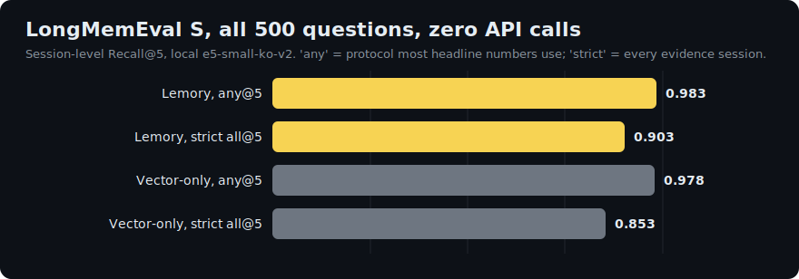
</div>

Recall@5 **0.972** on the protocol most headline numbers use, and we lead
with the stricter all-evidence number (0.857) instead of quoting only the
flattering one. LOCOMO LLM-judge 0.706 vs mem0's published 0.669; DMR
(500 q) 0.694 vs 0.648 same-harness naive RAG
([§7](BENCHMARKS.md)).

**[KorQuAD 1.0](https://korquad.github.io/)**, 140 real Korean Wikipedia
articles, 400 human-written questions:

| System | Recall@1 | Recall@5 | MRR@10 |
|---|---|---|---|
| **Lemory** (hybrid+graph) | **0.940** | 0.993 | **0.963** |
| BM25 | 0.928 | **0.993** | 0.954 |
| Vector-only RAG | 0.855 | 0.968 | 0.902 |

<sub>For most of this project's history BM25 won this table and we printed
that anyway, because SQuAD-family questions are written while looking at the
passage and vocabulary overlap is total. The 2026-07 Korean retrieval work
(IDF-weighted verbatim detection, jamo-level stem matching, syllable typo
repair) finally flipped it. The old table stays in the git history; the
robustness chart above is still the number that matters for real memory
queries.</sub>

**[KorMapleQA](benchmarks/data/kormapleqa/README.md)** is our contribution
back: 2,075 questions over the real namuwiki MapleStory domain (1,469
documents). Infobox facts, entity-masked references, 2-hop over real
wikilinks with shortcut-proof verification, temporal, keyword/반말/typo
registers, and verified-absent abstention questions. 100% code-generated
and machine-verified: reproducible with zero API keys, no LLM drafting
bias. e2e with a Gemini generator: containment-EM 0.617, and 7 of 8
unanswerable questions correctly refused.

Real vaults we didn't write are in the suite too: Steph Ango's (Obsidian
CEO) public vault and the official Obsidian Help vault
([§5d](BENCHMARKS.md)).

## Korean is a first-class citizen

Most of this space treats Korean as an afterthought. Lemory treats it as a
benchmark suite:

- **Hangul + kana + hanzi bigram indexing**: 조사가 붙은 어절, mixed-script
  runs like `ナイトロード나이트로드`, and JMS/CMS name tables all match.
  unicode61 tokenizers glue those into unmatchable tokens; bigrams fix it.
- **Syllable-level typo repair**: `메플이스토리` finds 메이플스토리. Adjacent
  transposition costs one edit (Damerau-Levenshtein over syllables), the way
  Korean typos actually happen. First-syllable typos are covered by a
  second-character index.
- **Morphology-aware verbatim detection**: jamo-level stem matching survives
  conjugation (`만든` matches `만들었다`), ㄹ-drop, and 띄어쓰기 variation.
  Question furniture (`~한 인물은?`) is stripped before coverage is scored.
- Queries in Korean over English notes score 0.950 full-support where BM25
  gets 0.250 and MemPalace 0.350.

## What it feels like

```
$ lemory ask "3분기 킥오프에서 예산 얼마로 잡았지?"                 # meetings
$ lemory ask "데이터플랫폼팀 리드가 누구고 무슨 일 하는 팀이지?"      # org / people
$ lemory ask "재택근무 정책, 작년이랑 지금이랑 뭐가 달라졌지?"        # policy diff over time
$ lemory ask "자바스크립트 이벤트 루프 뭐였지? 내 노트 기준으로"      # study notes
$ lemory ask "카오스 벨룸 가기 전에 준비물 뭐라고 적어놨더라?"        # game prep notes
$ lemory ask "오사카에서 갔던 그 라멘집 이름이 뭐였지?"              # travel log
```

The ones plain RAG structurally can't do:

```
$ lemory ask "프로젝트 아틀라스 리드가 좋아하는 DB가 뭐더라?"
# multi-hop: Atlas note → [[lead]] wikilink → that person's note has the answer

$ lemory ask "요새 내가 읽던 책 뭐였지?"
요즘 읽는 책은 어스시의 마법사이다 [1, 3].     # temporal: the *current* book
$ lemory ask "3월에 읽던 책은?"                # asking about March reaches history

$ lemory search "tag:회의록 folder:2026 예산"   # scoping operators, all modes
$ lemory remember "VPN 갱신은 매년 3월, 담당 김하늘" --tags ops   # write from the CLI
$ lemory import-chats conversations.json        # ChatGPT/Claude export → searchable notes
$ lemory graph --open                           # the whole vault as an interactive graph
$ lemory context                                # one-call vault digest for any agent
```

Typos are repaired against your vault's own vocabulary (no API). Renames,
deletes, aliases, Korean filenames: the watcher keeps up live.

## Why it performs: mechanism, not magic

- **Multi-hop 1.000 vs 0.53-0.81 (everyone else)**: retrieval expands 1 hop
  along your links, gated by query similarity AND lexical evidence (a
  neighbor chunk that already ranks in BM25's list carries the query's
  residual keywords), capped below direct evidence. Mined at index time
  without an LLM.
- **Robustness 0.95+ vs 0.25-0.67**: dense vectors and BM25 fail in
  *different* ways; weighted RRF fusion covers both. When a query quotes a
  note nearly verbatim (IDF-weighted coverage), BM25's ordering is pinned
  outright; rank-only fusion can't honor a decisive lexical margin.
- **Milliseconds, not seconds**: everything in-process, SQLite FTS5 + numpy.
  Above 20k chunks the vector side auto-switches to an IVF-int8 index
  (still numpy only): **1M chunks = 5.9 ms/query, recall@10 1.000 vs exact,
  732 MB RAM** ([§12b](BENCHMARKS.md)). We also benchmarked *replacing*
  SQLite (DuckDB, LanceDB) and published why we didn't
  ([report](docs/STORAGE.md)).
- **Cost that rounds to zero**: content-addressed embedding cache; the free
  Gemini tier runs ~250 questions/day; a fully on-device mode (Harrier
  embeddings + Qwen3-Reranker + Gemma 4 answers on one llama.cpp GPU engine, no
  daemon) for airgapped/망분리 environments where zero bytes may leave the machine.

## For developers

```python
import lemory
lemory.configure(vault="~/Obsidian/MyVault")
lemory.index()
print(lemory.ask("what did I decide about pricing?").text)
```

REST on `lemory serve`: `GET /search` · `POST /ask` · `GET /context` ·
`POST /memory` · `POST /append` · `POST /memory/trash` · `POST /index` ·
`GET /status`, plus the dashboard API (`/api/events`, `/api/clients`,
`/api/notes`, `/api/related`, ...). Identify your integration with the
`X-Lemory-Client` header (or `lemory mcp --client <name>`) and it shows up
attributed in the dashboard timeline.

Obsidian sidebar plugin (3-file copy install), PDF indexing
(`pip install 'lemory[pdf]'`, `index_pdf = true`), every retrieval knob in
[`lemory.toml`](docs/GUIDE.md), engineering deep-dives in
[BENCHMARKS.md](BENCHMARKS.md) · [docs/STORAGE.md](docs/STORAGE.md) ·
[docs/COMPETITIVE.md](docs/COMPETITIVE.md).

## How it works

```
 your vault (*.md) ──watch──► parse: frontmatter · tags · [[links]] · dates
                                 │
                                 ▼
              one SQLite file: chunks · BM25 · link graph · embed cache
                              + event timeline        + IVF-int8 (big vaults)
                                 │
 query ─► typo repair ─► dense + lexical (RRF fusion) ─► title & recency boosts
                                 │
                        1-hop graph expansion   ← multi-hop answers come from here
                                 │
                                 ▼
              dated, cited context (~550 tokens) ─► LLM ─► answer [n]

 save_memory ─► duplicate check ─► plain .md in your vault ─► searchable next question
```

Search is local and LLM-free (~3-13 ms). One embedding call per query
(cached), one generation call per `ask()`.

## Honesty section

- Verbatim quote-the-document questions used to favor pure BM25 and we
  printed that for as long as it was true. It stopped being true in the
  2026-07 Korean retrieval round (KorQuAD table above); the git history
  keeps the old numbers.
- On qmd's headline mode the honest read is a quality tie: 0.775 vs 0.769
  on identical questions is inside the confidence interval. The 2,930x
  latency difference is not.
- kepano's small English vault nearly saturates for dense-only retrieval;
  vector-only edges us there by one question and BENCHMARKS says so.
- 2-hop full-support on the 33k-chunk namuwiki corpus is an open problem
  for every system we measured, including us (0.141; qmd spends 60 s to
  reach 0.333). It's in BENCHMARKS as a standing challenge.
- LOCOMO/LongMemEval judged numbers use stratified samples sized for API
  budgets; `--all` flags run the full sets. Other teams' published numbers
  use different generators/judges and are quoted as context, not victory
  laps. Zep reports DMR 94.8 with a GPT-4-class setup; we don't claim it's
  beaten.
- We benchmarked replacing SQLite itself (DuckDB, LanceDB:
  [full report](docs/STORAGE.md)). LanceDB's FTS is genuinely ~5x faster
  than our FTS5 path on a worst-case corpus; we publish that and stay on
  SQLite anyway. It wins the other four axes (incremental sync x82, PK
  lookups x75, two-process access, zero native deps).
- mem0/cognee/supermemory/LightRAG comparisons on KorMapleQA use a labeled
  400-note subcorpus protocol because their per-note LLM ingest is billed;
  the full-corpus columns fill in when someone funds the API bill.

## Roadmap

- [ ] PyPI (`pip install lemory`) · [ ] Obsidian community plugin listing
- [x] AI write path + dashboard timeline with undo · [x] client attribution
- [x] Memory consolidation (duplicate flags + related links)
- [x] Link suggestions · [x] interactive graph export · [x] assistant skills
- [x] PDF indexing (opt-in) · [x] ANN index for 1M-chunk vaults
- [x] chat-export import (ChatGPT/Claude) · [x] KorMapleQA benchmark
- [ ] image OCR / audio transcription (opt-in extras) · [ ] web clipper
- [ ] multi-vault profiles

## Contributing

`uv venv && uv pip install -e ".[dev,mcp,local,pdf]" && pytest`: 332 tests, fully offline.
[CONTRIBUTING.md](CONTRIBUTING.md) · 한국어 이슈/PR 환영합니다.

Local-first by design. The trust model, the localhost server's guards
(CORS + Host-allowlist against DNS-rebinding), and how to report a
vulnerability are in [SECURITY.md](SECURITY.md).

**[한국어 README](README.ko.md)** · MIT
