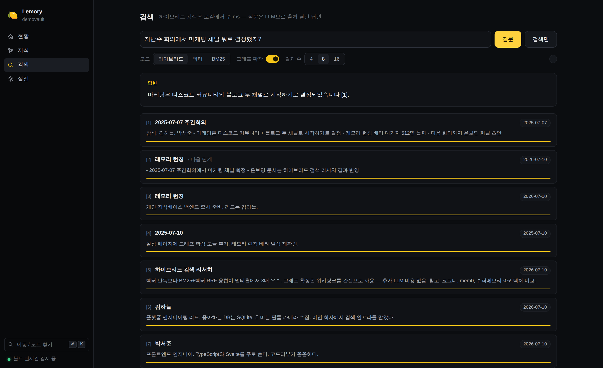

<div align="center">

# 🍋 Lemory

### 기록은 당신이 한다. 기억은 Lemory가 한다.
**You take the notes. It does the remembering.**

[](https://github.com/jwgo/lemory/actions)
[](LICENSE)
[](pyproject.toml)
[](BENCHMARKS.md)



</div>

---

## The problem

You've been taking notes for years. Daily logs, meeting notes, book highlights,
half-finished ideas — thousands of markdown files, faithfully accumulated.

And when you actually need something back, you `grep`. Or scroll. Or give up and
ask a coworker. **A second brain that can't answer back is just a filing cabinet.**

The memory-for-AI industry's answer is: upload everything to our cloud, we'll
extract "memories" with LLM pipelines, pay per API call. We think that's backwards.

## What we believe

1. **Your knowledge is already written down — and it's yours.** Lemory runs on
   *your* machine against *your* existing Obsidian vault. One SQLite file. No
   Docker, no vector DB, no sync to anyone's cloud. Delete the folder, it's gone.

2. **"When" is half of every memory.** Humans don't ask databases questions.
   They ask *"그거 뭐였지, 요새 내가 읽던 거?"* — vague, temporal, half-remembered.
   A real memory system must know that facts change, that "the current owner"
   means the newest note wins, and that "지난주" is a date range, not a keyword.

3. **Your links are already a knowledge graph.** Every `[[wikilink]]` you ever
   made is a curated edge. Others pay an LLM to reconstruct this structure;
   Lemory reads it for free — and that's exactly what answers multi-hop
   questions ("*그 프로젝트 리드가 좋아하는 DB가 뭐더라?*").

4. **Claims need receipts.** Every number below is reproducible from
   [`benchmarks/`](benchmarks/) — real public datasets, human-written questions,
   identical models for every system, and we publish where we *lose* too.

## Proof on real data — not our own synthetic sets

**[KorQuAD 1.0](https://korquad.github.io/)** — 140 real Korean Wikipedia
articles, 400 human-written questions (sampled from dev 5,774):

| System | Recall@1 | Recall@5 | MRR@10 | e2e answer EM (40q) |
|---|---|---|---|---|
| **Lemory** (hybrid+graph) | 0.908 | 0.985 | 0.943 | 0.900 |
| Vector-only RAG | 0.855 | 0.968 | 0.902 | 0.925 |
| BM25 | **0.923** | **0.993** | **0.952** | **0.950** |

<sub>Yes, **BM25 wins this table** and we print it anyway: SQuAD-family questions
are written while looking at the passage, so the vocabulary overlap is total —
grep-style search is genuinely enough for quote-the-document questions. But
nobody queries their own memory in verbatim quotes. Ask the same kind of corpus
in *your own words* — paraphrased, cross-lingual, typo'd — and BM25 collapses
while Lemory doesn't. That's the next two tables, and that's the product.</sub>

**나무위키 실문서 1,469편** (public 2021 dump, 33,375 chunks, **24,850 real
wikilink edges**) — code-verified QA (answer exists only in the gold note):

| System | Full-support@8 | Recall@1 | e2e F1 |
|---|---|---|---|
| **Lemory** | **0.820** | 0.820 | **0.594** |
| Vector-only RAG | 0.660 | 0.700 | 0.562 |
| BM25 | 0.560 | 0.540 | 0.406 |

**Questions the way people actually ask them** (paraphrased / Korean question →
English notes / keyword shorthand / typos; full-support@8):

| | original | paraphrase | 한국어 질문 | keyword | typo |
|---|---|---|---|---|---|
| **Lemory** | **1.000** | **0.946** | **0.975** | **0.982** | **0.965** |
| Vector-only | 0.544 | 0.464 | 0.475 | 0.482 | 0.491 |
| BM25 | 0.579 | 0.429 | 0.250 | 0.482 | 0.404 |

**Against the field** — same corpus, same embedding/generator/judge models
wherever the system allows it ([full methodology](BENCHMARKS.md)):

| | **Lemory** | mem0 | cognee | supermemory | LlamaIndex | qmd |
|---|---|---|---|---|---|---|
| Multi-hop answer-in-context@8 | **1.000** | 0.579 | 0.561 | 0.579 | 0.649 | 0.526² |
| [LOCOMO](https://github.com/snap-research/locomo) LLM-judge | **0.706** | 0.669¹ | — | — | — | — |
| Retrieval latency (p50) | **~3 ms** | 212 ms | ~5 s | 327 ms | 649 ms³ | 0.6–59 s |

<sub>¹ mem0's own published number. LongMemEval_S: 0.76 (GPT-4o full-context
baseline ≈ 0.60). DMR (500 q): 0.694 vs 0.648 same-harness naive RAG.
² qmd reports full-support@8. ³ LlamaIndex embeds every query via API,
uncached; its local-only retrieval is ~2 ms — the quality gap is
architectural, not compute.</sub>

### How that translates product-to-product

Only systems we ran ourselves, same corpus/models wherever their design allows
([methodology](BENCHMARKS.md)):

| | **Lemory** | mem0 OSS | cognee | supermemory | LlamaIndex |
|---|---|---|---|---|---|
| Runs as | 1 process, 1 SQLite file | + Qdrant vector store | + LanceDB & Kuzu stores | hosted API | library in your app |
| Knowledge graph from | your `[[wikilinks]]`, free | LLM fact extraction | LLM graph build (~45 min / 54 notes) | — | — |
| Ingest LLM calls (54 notes) | **0** | 1–2 per note | many per note | 0 (API-side) | 0 |
| Multi-hop answer-in-context@8 | **1.000** | 0.579 | 0.561 | 0.579 | 0.649 |
| Retrieval p50 | **~3 ms** | 212 ms | ~5 s | 327 ms | 649 ms (2 ms local) |
| 100% offline mode | yes (Ollama / fastembed) | no (LLM on ingest) | no (LLM on ingest) | no | with a local embedder |
| Korean retrieval | Hangul-bigram FTS, benchmarked | untested by us | untested by us | untested by us | untested by us |
| Data location | your disk only | your disk | your disk | their cloud | your disk |

Five externally measured systems. mem0 and supermemory are conversational-memory products first — this table
measures them on the personal-document-KB job Lemory is built for, which is
exactly the design difference it quantifies. cognee targets the same job.

## What it feels like

Anything you ever wrote down becomes askable — work, study, games, life:

```
$ lemory ask "3분기 킥오프에서 예산 얼마로 잡았지?"                 # meetings
$ lemory ask "데이터플랫폼팀 리드가 누구고 무슨 일 하는 팀이지?"      # org / people
$ lemory ask "재택근무 정책, 작년이랑 지금이랑 뭐가 달라졌지?"        # policy diff over time
$ lemory ask "자바스크립트 이벤트 루프 뭐였지? 내 노트 기준으로"      # study notes
$ lemory ask "카오스 벨룸 가기 전에 준비물 뭐라고 적어놨더라?"        # game prep notes
$ lemory ask "알러지 올라올 때 대처 순서 뭐였지?"                    # health protocols
$ lemory ask "전세 갱신 거절당하면 뭐부터 한다고 정리해놨지?"         # legal/admin notes
$ lemory ask "오사카에서 갔던 그 라멘집 이름이 뭐였지?"              # travel log
```

The ones plain RAG structurally can't do:

```
$ lemory ask "프로젝트 아틀라스 리드가 좋아하는 DB가 뭐더라?"
# multi-hop: Atlas note → [[lead]] wikilink → that person's note has the answer

$ lemory ask "요새 내가 읽던 책 뭐였지?"
요즘 읽는 책은 어스시의 마법사이다 [1, 3].     # temporal: the *current* book,
$ lemory ask "3월에 읽던 책은?"                # …but asking about March reaches history

$ lemory recent          # what was I touching lately? (no LLM, instant)
$ lemory doctor          # one-shot diagnosis: vault / key / API / index
```

Typos are repaired against your vault's own vocabulary (no API). List questions
("읽은 책 전부?") auto-widen retrieval. Renames, deletes, aliases, Korean
filenames — the watcher keeps up live.

## Quickstart — 2 minutes, 1 free key (or none)

```bash
pipx install "git+https://github.com/jwgo/lemory"
lemory setup      # vault path + free Gemini key → health check + first index
lemory ask "요새 내가 하던 그 프로젝트 어디까지 했지?"
lemory serve      # web console (screenshot above) + live vault watcher
```

`lemory serve` ships a full **web console** at `127.0.0.1:8377` — not just a
search box:

- **현황** — index stats, sync activity feed, models/storage, one-click reindex
- **지식** — your vault as a browsable hierarchy: folder tree, tags, per-note
  chunks, outgoing links & backlinks (wiki/mention/entity)
- **검색** — hybrid/vector/BM25 playground with graph toggle, score bars,
  latency readout, and LLM answers with citations
- **설정** — retrieval knobs with live apply, persisted to `lemory.toml`
- <kbd>⌘K</kbd> command palette to jump anywhere or fuzzy-find a note


**New here? Step-by-step guide: [docs/GUIDE.md](docs/GUIDE.md)
(한국어: [docs/GUIDE.ko.md](docs/GUIDE.ko.md)).**

## Running it for free

Two fully-free paths, pick one:

**1. Gemini free tier (recommended)** — a key from
[aistudio.google.com](https://aistudio.google.com) takes 2 minutes and needs no
credit card; without a billing account there is nothing to accidentally spend.
What Lemory actually consumes:

| Action | Cost | Free-tier headroom |
|---|---|---|
| First index of 1,000 notes (~3,000 chunks) | ~47 embedding calls | ~5% of one day's quota |
| Re-index after editing a note | only that note's chunks | negligible |
| Full re-index, unchanged vault | **0 calls** (content-hash cache) | unlimited |
| Search | 1 embedding call (cached per query) | hundreds/day |
| `ask()` — answer with citations | 1 embed + 1 generation | **~250 questions/day** |

Hitting the limit never bills you — Lemory rate-limits itself, waits out 429s,
and falls back to `gemini-2.5-flash-lite` under load.

**2. No key at all — two local modes**, both one keypress in `lemory setup`:

- **Fully local (Ollama)** — Gemma 3n E4B (4-bit, ~5.6 GB) generates answers,
  Qwen3-Embedding-0.6B (~640 MB, 1024d) does retrieval. *Everything* including
  `ask()` runs offline; nothing ever leaves your machine. Needs 8 GB+ RAM.
- **Search-only local (fastembed)** — multilingual MiniLM (220 MB, 4 GB RAM is
  plenty). Indexing, search, console, knowledge explorer all offline; only
  `ask()`'s generation wants a key. Mixed mode works too: local embeddings +
  API generation — only the few retrieved chunks are ever sent out.

Switching embedding models is detected automatically and triggers a one-time
full re-embed (different models = different vector spaces; stale vectors would
silently corrupt search). The cache is per-model, so switching *back* is free.

## Why it performs — mechanism, not magic

Each headline number above traces to one specific design choice:

- **Multi-hop 1.000 vs 0.53–0.58 (everyone else)** — your `[[wikilinks]]` and
  unlinked title mentions *are* the knowledge graph. Retrieval expands 1 hop
  along them, gated by query similarity and capped below direct evidence, so
  "Atlas의 리드가 좋아하는 DB는?" hops Atlas → 리드 → answer. Vector search
  can't find a note that shares no words with the question; Lemory follows the
  edge you drew. And because the graph is mined at index time without an LLM,
  it costs nothing — cognee pays ~45 min of LLM calls to build a graph for a
  54-note vault; Lemory's graph on the same vault is free and scored higher.
- **Robustness 0.95+ vs 0.25–0.54 on paraphrase/한국어/typo/keyword queries** —
  dense vectors and BM25 fail in *different* ways, so weighted RRF fusion
  covers both; Korean gets Hangul-bigram FTS (agglutinative morphology breaks
  word-token BM25); unknown query words are repaired against the vault's own
  lexicon before search, with zero API calls.
- **Latency ms not seconds** — no vector-DB server round trip: exact numpy
  cosine + SQLite FTS5 in-process. Measured scaling (hybrid+graph, full
  pipeline): 2k chunks → 5.5 ms · 10k → 17 ms · 50k → 70 ms. On the real
  33k-chunk 나무위키 corpus with bigram FTS: ~0.2 s/query — still 25× faster
  than cognee's 5 s.
- **Cost that rounds to zero** — embeddings are content-addressed
  (`sha256(model|dim|task|text)`), so nothing is ever embedded twice;
  `context_style="compact"` packs retrieved evidence into ~550-token dated
  fact sheets, supermemory-style, with no extra LLM calls.
- **Time awareness** — "지난주", "요새", "3월에" parse to date ranges; changed
  facts resolve to the newest note unless you ask about the past.

## Big vaults are fine

The largest corpus in our benchmarks is real: **1,469 나무위키 documents,
33,375 chunks, 24,850 real wikilink edges** — one SQLite file, searched at
~0.2 s/query with recall@8 1.00. Embedding a corpus that size once takes a
while on a free tier (the cache makes it a one-time cost); everything local —
parsing, link mining, FTS, graph — is seconds. Indexing is incremental: a
10,000-note vault that changes 5 notes today re-processes 5 notes. The
synthetic scaling test holds full hybrid+graph search under 80 ms at 50k
chunks, and giant single documents are fine — the chunker splits along
heading structure.

Honest ceiling: a whole life + whole job is typically 10k–50k notes
(50k–300k chunks) — inside the design envelope (100k chunks ≈ 300 MB RAM for
the vector matrix, 0.1–0.2 s queries), though first-time embedding at that
scale wants a paid tier (a few dollars, once). **Millions** of chunks — a
whole company's document store — is beyond the comfortable range of the
exact-search architecture; an ANN index option is on the roadmap, as is
PDF/attachment indexing (today it's `.md` only).

<details>
<summary><b>Obsidian</b> — sidebar panel, click a citation to open the note</summary>

```bash
cp obsidian-plugin/{main.js,manifest.json,styles.css} <vault>/.obsidian/plugins/lemory/
```
Enable in Settings → Community plugins. Needs `lemory serve` running.
</details>

<details>
<summary><b>Claude Code / Claude Desktop / VS Code</b> — MCP, six tools</summary>

```bash
claude mcp add lemory -- lemory mcp --vault ~/Obsidian/MyVault
```
`search_notes` · `ask_notes` · `recent_notes` · `read_note` · `list_notes` · `vault_status`
</details>

<details>
<summary><b>Python / HTTP</b></summary>

```python
import lemory
lemory.configure(vault="~/Obsidian/MyVault")
lemory.index()
print(lemory.ask("what did I decide about pricing?").text)
```
REST: `GET /search`, `POST /ask`, `POST /index`, `GET /status` on `lemory serve`.
</details>

## How it works

```
 your vault (*.md) ──watch──► parse: frontmatter · tags · [[links]] · dates
                                 │
                                 ▼
              one SQLite file: chunks · BM25 · link graph · embed cache
                                 │
 query ─► typo repair ─► dense + lexical (RRF fusion) ─► title & recency boosts
                                 │
                        1-hop graph expansion   ← multi-hop answers come from here
                                 │
                                 ▼
              dated, cited context (~550 tokens) ─► LLM ─► answer [n]
```

Search is local and LLM-free (~3 ms). One embedding call per query (cached),
one generation call per `ask()`. `context_style="compact"` aggregates retrieved
chunks into dated one-line facts — supermemory-style token efficiency with zero
extra LLM calls.

## Honesty section

- KorQuAD-style verbatim questions favor pure BM25 (we show it above). Lemory
  detects verbatim phrasing per-query and leans lexical, but we tuned for the
  robustness table — real questions aren't quotes.
- LOCOMO/LongMemEval numbers use stratified samples (160/100 q) sized for API
  budgets; `--all` flags run the full sets. Other teams' published numbers use
  different generators/judges and are quoted as context, not victory laps.
- Zep reports DMR 94.8 with a GPT-4-class setup; in our identical-model harness
  Lemory beats naive RAG by +4.6 pt. We don't claim their number's beaten.

## Roadmap

- [ ] PyPI (`pip install lemory`) · [ ] Obsidian community plugin listing
- [ ] PDF/attachment indexing · [ ] budget-aware entity-graph enrichment on by default
- [ ] multi-vault profiles

## Contributing

`uv venv && uv pip install -e ".[dev]" && pytest` — 236 tests, fully offline.
[CONTRIBUTING.md](CONTRIBUTING.md) · 한국어 이슈/PR 환영합니다.

**[한국어 README](README.ko.md)** · MIT
