<div align="center">

# 🍋 Lemory

### AI 에이전트의 컨텍스트 데이터베이스. 가상 파일시스템이 아니라, 진짜 파일로.
**기억 · 지식 · 스킬을 내 폴더의 마크다운으로 통합합니다. 호스팅 DB도, 계정도, 쿼터도 없이, 전부 실측으로 증명하면서.**
<sub>The context database for AI agents, on real files · **[English README](README.en.md)**</sub>

[](https://github.com/jwgo/lemory/actions)
[](LICENSE)
[](pyproject.toml)
[](BENCHMARKS.md)
[](benchmarks/data/kormapleqa/README.md)

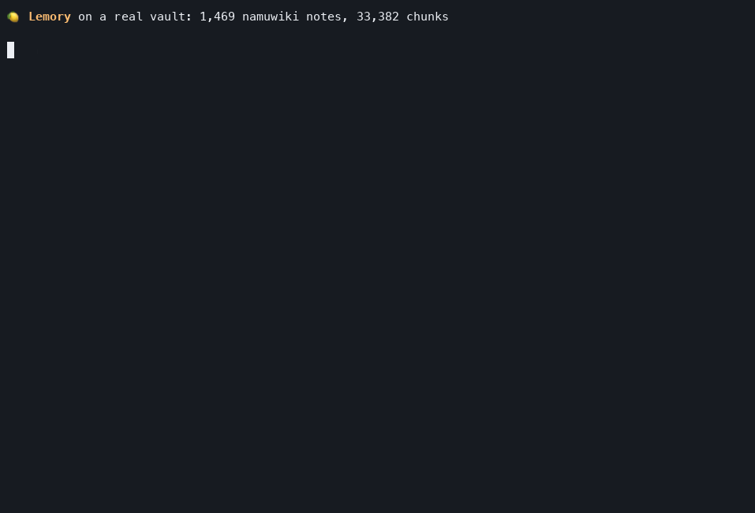

<sub>목업이 아닙니다. 나무위키 실제 문서 1,469개(청크 약 42,000개) 볼트에서
한국어 질문이 0.1초 만에 답변되고, 오타는 API 없이 교정되는 장면입니다.
[`benchmarks/`](benchmarks/)로 직접 재현할 수 있습니다.</sub>

</div>

---

**Lemory는 AI 에이전트를 위한 로컬 컨텍스트 데이터베이스입니다.** 에이전트가
필요로 하는 컨텍스트(기억, 지식, 스킬)를 내 폴더의 마크다운 파일 하나의
체계로 통합합니다. Claude Code, Claude Desktop, Cursor, 직접 만든 에이전트가
매 세션 낯선 사람으로 시작하지 않게 하고, 마크다운 노트가 이미
있다면(옵시디언이든 그냥 폴더든) 그것이 곧바로 컨텍스트가 됩니다.

2026년, 시장은 이 방향으로 수렴했습니다. ByteDance의 OpenViking(32.8k★,
VLDB 2026)이 "컨텍스트 데이터베이스"라는 카테고리를 만들며 벡터 스토어
대신 **파일시스템 패러다임**을 택했고, Tencent의 Agent Memory가 기억
피라미드를, Vectorize의 Hindsight가 retain-recall-reflect를 택했습니다.
방향은 전부 맞습니다. 그런데 그들의 파일시스템은 `viking://` 같은 **가상
경로**이고, 밑에는 여전히 그들의 DB가 있습니다. Lemory는 반대쪽 끝에서
출발했습니다: **당신이 이미 가진 진짜 파일이 데이터베이스입니다.** `ls`,
`grep`, `git`, 옵시디언이 그대로 관리 도구이고, 떠나는 비용은 0입니다.
그리고 그 선택이 성능을 깎지 않는다는 것을, 오히려 이긴다는 것을,
돌릴 수 있는 경쟁자 전부와 같은 하네스에서 측정해 보여줍니다.

- **하나의 파일 체계에 모든 컨텍스트.** 타입 있는 기억 파편, 장면 서사,
  페르소나, 추출된 스킬, 그리고 당신의 노트까지 전부 볼트 안의 평범한
  `.md`입니다. 가상 계층이 없으니 에이전트용 뷰와 사람용 뷰가 같은
  파일이고, `rm` 한 번이면 지워집니다. 계정도, 파편 쿼터도, 이사 비용도
  없습니다.
- **계층 로딩(L0/L1/L2)으로 토큰을 아낍니다.** 모든 노트를 L0 한 줄 요약,
  L1 개요(제목 골격 + 섹션 도입부), L2 원문 세 단계로 읽을 수 있습니다.
  다른 컨텍스트 DB는 이 계층을 **쓰기 시점에 LLM으로 생성**하지만, Lemory는
  **읽기 시점에 결정적으로 유도**합니다. LLM 0회, 원본과 어긋날 수 없습니다.
  세션 부트는 피라미드(페르소나+장면 지도)가 맡아 원문 덤프의 1/48.8
  토큰으로 시작합니다.
- **검색이 실측으로 고성능입니다.** 의미 + 한국어 특화 키워드 +
  `[[위키링크]]` 그래프 + 시간 창, 4개 다리의 하이브리드 융합.
  같은 하네스에서 키리스 0.983@40ms, 임베딩 없는 fast 모드 0.967@6.9ms.
  지는 항목까지 전부 공개합니다.
- **관찰 가능합니다.** 모든 질의, AI가 쓴 모든 노트(클릭 한 번 되돌리기),
  클라이언트별 사용량이 타임라인에 남습니다. 전부 내 컴퓨터의 SQLite 파일
  하나입니다.
- **스스로 진화합니다.** 세션이 끝나면 대화가 사실 아톰으로 증류되고, 장면
  서사와 페르소나로 승격됩니다(`auto_consolidate` 한 줄이면 자동). LLM이
  없으면 결정적 폴백으로 동작해 완전 오프라인에서도 피라미드가 유지됩니다.

> **Lemory를 "거쳐야만" 하는 것은 아무것도 없습니다.** 볼트는 그냥
> 파일입니다. 늘 하던 대로 노트를 쓰면(옵시디언이든, 아무 편집기든) 워처가
> 1초 안에 색인합니다. `save_memory`와 `lemory remember`는 *AI가* 쓸 때
> 출처 표시, 중복 검사, 되돌리기 버튼을 붙이기 위한 통로일 뿐입니다.
> 문지기가 아니라 손님용 입구입니다.

## 왜 시장에서 우위인가 (2026년 8월 기준)

에이전트 메모리는 2026년 현재 자체 벤치마크 스위트와 연구 문헌을 가진
1급 아키텍처 컴포넌트가 됐고, 업계 보고서들이 꼽는 요구 조건도
수렴했습니다: 멀티시그널 검색, 메타데이터 필터링, 시간 추론, 갱신
의미론(모순·번복 보존), 관찰가능성, 토큰 효율. **Lemory는 이 목록 전체를
충족하며, 각 항목에 재현 가능한 숫자를 붙여 놓았습니다.**

| 업계가 요구하는 축 | Lemory의 답 | 실측 |
|---|---|---|
| 멀티시그널 검색 | 벡터 + 한국어 바이그램 BM25 + 링크 그래프 + 시간 창, 4-레그 융합 | 멀티홉 1.000 · 키리스 0.983@40ms ([§0](BENCHMARKS.md)) |
| 시간 추론 | 시간 인지 랭킹 + `after:`/`before:` 연산자 + temporal 검색 레그 | LongMemEval temporal 0.835, 전체 any@5 0.983 ([§7d](BENCHMARKS.md)) |
| 갱신 의미론 | `belief` 제자리 개정 + `## 변천` 이력, 삭제 없는 최신 우선, 번복 함정 실측 | AgentMemQA 함정 오답률 0 ([§7f](BENCHMARKS.md)) |
| 토큰 효율 | L0/L1/L2 계층 로딩 + 피라미드 부트 | 부트 컨텍스트가 원문 덤프의 1/48.8 ([§14](BENCHMARKS.md)) |
| 관찰가능성 | 전 질의·전 쓰기 타임라인, 클라이언트 출처, 클릭 한 번 되돌리기 | 대시보드 표준 탑재 |
| 색인 비용 | **LLM 0회** 결정적 색인 | 1,469노트 수 초 vs 경쟁 14분~45분 ([§4](BENCHMARKS.md)) |

그 위에 경쟁자가 구조적으로 따라오기 어려운 축이 넷 있습니다.

1. **진짜 파일.** OpenViking의 계층은 쓰기 시점 LLM 생성이고(없으면
   플레이스홀더로 퇴화), 저장소는 가상 경로 밑의 그들 DB입니다. Lemory의
   계층은 읽기 시점 결정적 유도이고 저장소는 당신의 `.md`입니다. 이탈
   비용 0은 아키텍처의 결과라 마케팅으로 복제할 수 없습니다.
2. **키리스 로컬 고성능.** 기본 설치 그대로, API 키 없이, 검색이
   밀리초입니다. 같은 무-LLM 조건에서 Hindsight 최선 구성의 4.2배
   recall입니다 ([§4j](BENCHMARKS.md)). 관리형 API 진영(mem0 등)의
   헤드라인 수치는 쿼리당 수천 토큰의 LLM 비용 위에 서 있습니다.
3. **한국어(넓게는 CJK)가 1등 시민.** 이 분야 상위권 전부가 영어
   우선입니다. 시장이 커질수록 이 격차는 커지는데, 격차를 좁히려면 저희가
   공개한 것과 같은 다국어 벤치마크가 필요하고, 그것을 공개한 곳이
   저희뿐입니다(KorMapleQA 2,075문항).
4. **측정 문화.** 이 시장에서 same-harness 교차 비교 수치를 공개하는
   프로젝트는 Lemory가 유일합니다. 지는 항목, 실패한 실험, 후퇴까지 함께
   공개하므로 숫자가 신뢰를 만듭니다. 벤치마크 주장이 즉시 커뮤니티
   검증대에 오르는 2026년 시장에서 이것 자체가 해자입니다.

## 증거부터 보여드립니다

모든 수치는 커밋된 코드와 공개 데이터로 다시 만들 수 있습니다. 방법, 지는
항목, 아직 못 푼 문제까지 [BENCHMARKS.md](BENCHMARKS.md)에 있습니다.

<div align="center">
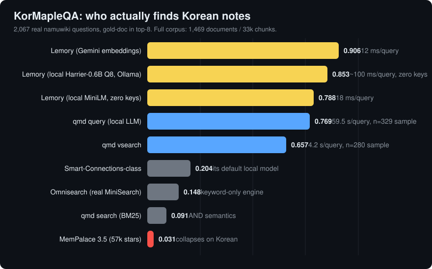
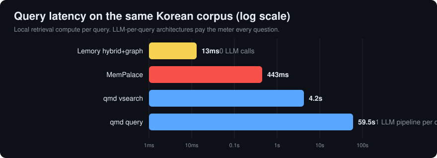
</div>

## 같은 질문을 실제 도구 3개에 던져봤습니다

<div align="center">
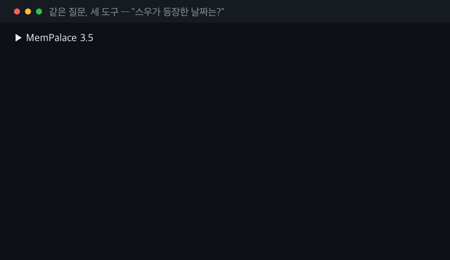
</div>

같은 볼트에서 [tobi/qmd](https://github.com/tobi/qmd)와 MemPalace를 실제로
돌린 장면입니다. qmd는 키워드를 전부 포함해야만 찾는 방식(AND)이라 한국어
자연어 질문에 0건이 나옵니다. MemPalace는 영어 위주 임베더라 한국어 키워드
경로가 없습니다. Lemory는 정답 노트를 1위로, 0.1초에, LLM 호출 없이
찾습니다.

qmd가 로컬 LLM을 총동원해도(질의 확장 + 리랭크) 같은 329문항에서 Lemory의
LLM 없는 검색보다 낮습니다. 그러면서 질문 하나에 59.5초가 걸립니다:

<div align="center">
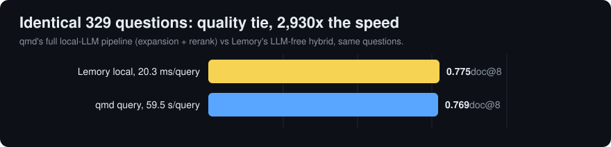
</div>

깃허브 스타가 가장 많은 메모리 레이어 mem0와도 같은 데이터, 같은 모델로
끝까지 비교했습니다:

<div align="center">
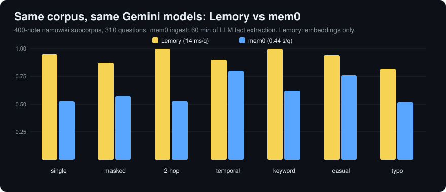
</div>

## 명령 한 줄이면 시작됩니다

```bash
pipx install "git+https://github.com/jwgo/lemory"
lemory up ~/Obsidian/MyVault     # 설정 → 색인 → 대시보드까지 한 번에
lemory ask "요새 내가 하던 그 프로젝트 어디까지 했지?"
```

입구는 `lemory up` 하나입니다. 알아서 최적 모드를 고릅니다. Gemini 키가
있으면 클라우드로, 없으면 **기본 탑재된 온디바이스 스택**(한국어 특화
e5-small-ko-v2 임베딩 + Gemma 4 답변)으로 동작합니다. 키도, 데몬도, 설정도
필요 없습니다. `lemory up`만 치면 볼트 위치를 묻습니다. 모델과 검색
설정은 대시보드 **설정** 탭에서 바꿉니다.

그다음에는 **`lemory daemon start` 한 줄로 켜두면 됩니다** (터미널 닫아도
유지 · `status`/`logs`/`stop`으로 관리, 죽은 pidfile 자동 정리).
포그라운드가 좋으면 `lemory serve`도 그대로입니다. 옵시디언 플러그인,
Claude/MCP, 웹 대시보드가 전부 여기에 붙고, 노트를 고치면 몇 초 안에 다시
색인됩니다. `lemory ask "..."` 한 줄은 서버 없이도 동작합니다. 언제 켜두고
언제 재색인하는지는 [가이드](docs/GUIDE.ko.md)에 있습니다.

색인할 때 LLM이 아예 돌지 않습니다. **노트 1,000개 색인 = LLM 호출 0회**,
몇 초면 검색이 됩니다. 노트 54개에 LLM 그래프를 만드느라 45분씩 쓰는
제품들과 비교하면:

<div align="center">
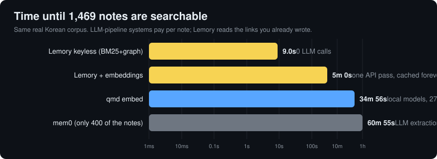
</div>

**처음이라면 여기부터: [docs/GUIDE.ko.md](docs/GUIDE.ko.md) · 매일 쓰는 법:
[docs/ROUTINE.ko.md](docs/ROUTINE.ko.md) (English: [docs/GUIDE.md](docs/GUIDE.md))**

## 어떤 AI에게든 기억을 줄 수 있습니다

```bash
claude mcp add lemory -- lemory mcp --vault ~/Obsidian/MyVault --client claude-desktop
lemory skill install claude-code    # 잘 쓰는 법까지 가르치기
```

| 클라이언트 | 설정 |
|---|---|
| Claude Code / Desktop | `claude mcp add lemory -- lemory mcp --vault <vault> --client claude-code` |
| Cursor | `.cursor/mcp.json`에 추가: `{"lemory": {"command": "lemory", "args": ["mcp", "--vault", "<vault>", "--client", "cursor"]}}` |
| Windsurf / VS Code / Codex CLI / 다른 MCP 클라이언트 | 같은 명령: `lemory mcp --vault <vault> --client <name>` |
| 스크립트 / 직접 만든 에이전트 | REST + `X-Lemory-Client` 헤더 (아래 참고) |

`--client`에 적은 이름이 대시보드 사용량에 그대로 표시됩니다. 누가 내
기억을 읽고 쓰는지 항상 알 수 있습니다.

툴은 20개입니다. 읽기: `search_notes` · `ask_notes` · `recent_notes` ·
`read_note`(**계층 로딩**: `level=abstract|overview|full` · 관련성 판단은
L0 한 줄로, 원문은 필요할 때만) · `context_tree`(볼트를 파일시스템처럼
탐색: 폴더 트리 + 노트별 L0 한 줄) · `list_notes` · `related_notes` ·
`suggest_links`(아직 연결 안 된 언급을 문장 증거와 함께 링크로 제안) ·
`vault_status` · `vault_context`(페르소나·장면 지도·고정 앵커·열린
케이스·최근 활동을 한 번에, LLM 없이 수 ms). 쓰기: `save_memory`(저장하면서
중복 검사와 관련 노트 연결까지) · `append_note`(덮어쓰기 불가, 볼트 밖으로
못 나감). 그리고 아래 에이전트 작업 기억 8개입니다.

### 에이전트 작업 기억: remember → recall → reflect → resume

에이전트가 매번 처음부터 다시 시작하지 않게 하는 툴들입니다. 기억 파편은
**타입이 있고**(`fact`·`decision`·`error`·`preference`·`procedure`·`relation`·`episode`·`belief`),
`belief`는 확신도(0-1)를 달고 같은 제목으로 다시 기억하면 복제 대신
**제자리 개정**됩니다(밀려난 진술은 `## 변천`에 누적 · 증거와 추론의
분리는 Hindsight에서 배웠습니다). 세션보다 오래 사는 작업 스레드인
`case`에 묶입니다.

| 툴 | 하는 일 |
|---|---|
| `remember` | 타입 있는 파편 하나 저장 (`error`는 해결 표시 전까지 `open`으로 태어남) |
| `recall` | 종류·케이스·주제·상태·최근성으로 좁혀서 회상 · 좁히는 건 후보 선정이고 순위는 여전히 하이브리드 검색이 매김 |
| `reflect` | 세션 마무리: 요약·결정·해결한 오류·다음 단계를 `episode` 노트 하나로, 건드린 노트와 `[[위키링크]]`로 연결 |
| `resume_case` | 스레드 복원: 타임라인, 지금까지의 결정, 아직 안 풀린 오류, 직전 세션이 적어둔 다음 단계 |
| `list_cases` | "내가 뭐 하다 말았지?" |
| `anchor_note` | 노트를 코어 기억으로 고정 · 이후 모든 세션의 `vault_context` 맨 위에 주입 |
| `consolidate_memory` | 피라미드 승격: 새 기억을 장면 노트와 페르소나에 통합 (아래) |
| `extract_skills` | 완결된 케이스에서 재사용 SKILL 문서 추출 · 게이트를 못 넘으면 아무것도 쓰지 않음 (그것이 정답인 경우가 대부분) |

CLI에서도 같은 루프가 돕니다:

```bash
lemory remember "포트 8080이 이미 점유되어 서버가 안 뜬다" --type error --case 배포
lemory recall 포트 --type error      # 좁혀서 회상
lemory cases                          # 미해결 개수까지 붙은 스레드 목록
lemory case 배포                      # 스레드 재개
lemory anchor "memories/언어 선호.md"  # 코어 기억으로 고정
lemory consolidate                    # L1 아톰 → L2 장면 → L3 페르소나 승격
```

### 기억 피라미드: 대화 → 아톰 → 장면 → 페르소나

TencentDB Agent Memory(11.3k★)가 검증한 4층 구조를 볼트 위에서 돌립니다.
세션 기록(L0)에서 증류된 사실(L1)이 **장면 노트**(`장면/*.md` · 맥락별 살아
있는 서사, 개수 상한이 있어 새 파일 대신 통합이 기본)와 **페르소나
노트**(`페르소나.md` · 2000자 캡, 점진 갱신)로 올라갑니다. 세션이 시작되면
`vault_context`가 페르소나와 장면 지도를 먼저 내밀고, 장면 본문은
`read_note`로, 원본은 검색으로 필요할 때만 팝니다. 서버를 켜두면
`auto_consolidate = true` 한 줄로 승격이 자동이 됩니다 · 새 기억이 몇 분
조용해지면 알아서 장면·페르소나로 올라갑니다(설정 탭 토글).

실측했습니다(RoleMemQA 8관계×30세션, 재현: `benchmarks/run_pyramid.py`):
항상 주입되는 부트 컨텍스트가 **1,345토큰 · 원문 덤프(65,602토큰)의
1/48.8**인데 페르소나 사실 질문의 34.7%가 그 안에서 바로 답합니다. 장면
하나만 드릴하면 66.7% @ 2,084토큰, 나머지는 검색층이 100%로 받습니다.
그쪽 발표치(PersonaMem +59%)는 리포에 하네스가 없어 재현이 불가능합니다 ·
저희 수치는 전부 스크립트 하나로 다시 나옵니다.

그쪽과의 차이는 밑단입니다. 그쪽 증류는 OpenAI 호환 API가 필수지만
(그쪽 "로컬 모드"도 원격 모델 호출입니다), `lemory consolidate`는 LLM이
있으면 서사를 쓰고 **없으면 결정적 폴백**으로 구조화 다이제스트를 씁니다 ·
완전 오프라인에서도 피라미드가 유지됩니다. 그리고 장면·페르소나가 평범한
볼트 노트라서 하이브리드 검색과 링크 그래프에 그대로 잡힙니다. 소스 레벨
분석과 정면 비교는 [docs/COMPETITIVE.md](docs/COMPETITIVE.md)에 있습니다.

### MCP를 못 쓰는 클라이언트도: 메모리 프록시

`lemory serve`가 **OpenAI 호환 `/v1/chat/completions`** 를 함께 엽니다.
baseURL만 바꾸면 어떤 SDK·스크립트·IDE 플러그인이든 기억이 생깁니다:

```python
from openai import OpenAI
client = OpenAI(base_url="http://127.0.0.1:8377/v1", api_key="unused-locally")
r = client.chat.completions.create(model="gpt-4o-mini",
    messages=[{"role": "user", "content": "우리 배포 포트가 몇 번이었지?"}])
# → "현재 배포 포트는 15000으로 설정되어 있습니다. 사내 프록시가 쓰는
#    8080과의 충돌을 피하기 위해서…"  (볼트 기억으로 근거 있는 답)
```

요청이 지나갈 때 피라미드 부트(페르소나+장면 지도)와 그 턴의 관련 기억이
시스템 메시지로 주입되고, 응답이 돌아오면 대화가 `chats/proxy/` 세션
노트로 저장됩니다(`proxy_capture = false`로 끔) · 다음 `consolidate`가
그것을 피라미드로 올립니다. **읽기와 쓰기가 모두 무료로 붙습니다.**
스트리밍은 그대로 통과하고, 업스트림 키는 설정에서만 읽습니다(클라이언트
Authorization은 전달하지 않습니다 · 로컬 포트가 새어도 과금 키는 새지
않습니다). 업스트림은 `proxy_upstream`으로 바꿉니다 · 기본 OpenAI지만
OpenAI 호환이면 무엇이든 됩니다. Ollama(`http://localhost:11434/v1`)를
가리키면 **모델까지 포함해 완전 로컬인 메모리 프록시**가 됩니다.

핵심은 파편의 **정체성**입니다. 남의 Postgres 안 row가 아니라 내 볼트의
마크다운 노트입니다. 쓰는 즉시 옵시디언에 뜨고, 손으로 고치고, 깃 diff가
나오고, 나머지 노트와 **같은 인덱스·같은 링크 그래프**에 삽니다 ·
`reflect`가 만든 에피소드는 인용한 노트와 이어진 진짜 그래프 노드입니다.
계정도 파편 한도도 없습니다. 상한은 디스크입니다. 타입 층은 좁힐 뿐
저장소를 쪼개지 않아서 `search_notes`는 여전히 전부 봅니다.

파편 메타데이터는 평범한 frontmatter라서 스코핑이 어디서나 통합니다 ·
CLI든, 웹 검색창이든, `search_notes`든 `type:error case:배포`.

### 세션 기억은 자동으로 남습니다 (명령 하나)

```bash
lemory hooks install claude-code
```

이제 Claude Code 세션이 끝날 때마다 기억할 만한 결정·사실·미결 사항이
**날짜 붙은 노트 하나**로 볼트에 저장됩니다. 부지런할 필요가 없습니다.
다른 훅 기반 도구들과 달리, 저장된 것은 전부 대시보드 피드에 출처와
되돌리기 버튼과 함께 표시됩니다. 수동으로 관리하고 싶다면 `CLAUDE.md`에
이렇게 적어도 됩니다:

```markdown
세션 시작 시 lemory의 vault_context를 한 번 불러 상황을 파악해라. 결정이나
기억할 사실, 선호가 정해지면 save_memory로 저장해라(간결하게, 노트당 기억
하나). 내 노트가 이미 답하는 것은 나에게 묻기 전에 search_notes로 검색해라.
```

**프라이버시는 파일 속성입니다.** 노트 맨 위에 `lemory: false` 한 줄만
적으면 그 노트는 색인도, 검색도, 어떤 모델로도 전송되지 않습니다. 이미
색인됐던 노트라면 이 한 줄이 제외시킵니다.

## 한 번 말하면, 기억합니다

<div align="center">
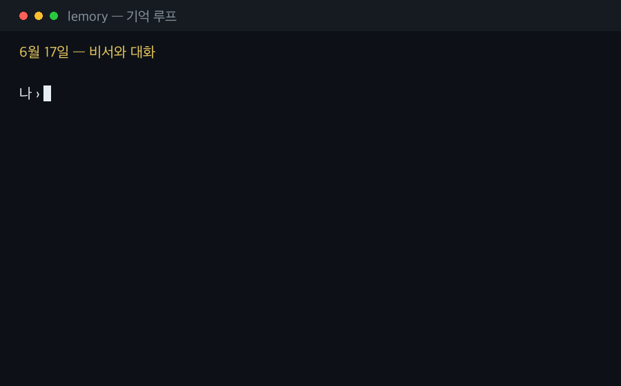
</div>

비서는 대화하면서 **읽고 씁니다**. "…라고 기억해줘"라고 말하면 그 자리에서
노트로 저장됩니다(승인제를 켰다면 대기열로 갑니다). "그건 언제였지?" 같은
후속 질문은 앞 질문과 묶어서 찾습니다. 첫 대화에는 볼트 상황 요약이
자동으로 들어가고, `/검색` `/기억` `/최근` 명령도 쓸 수 있습니다.

비서와 나눈 대화는 `chats/` 폴더에 날짜 붙은 노트로 자동 저장됩니다.
열어보고, 고치고, 지울 수 있는 평범한 마크다운 파일입니다. 그 투명함이
곧 되돌리기 버튼입니다. 한 달 뒤에 "내 여동생 이름 뭐랬지?"라고 물으면
출처와 함께 수 ms 만에 돌아옵니다. 위에 얹을 수 있는 선택 기능 두 가지:

- **`lemory distill`**: 원할 때만 돌리는 후처리입니다. 온디바이스 Gemma가
  대화를 팩트 요약 노트로 정리하고 출처를 [[위키링크]]로 남깁니다.
  지저분한 채팅 벤치 실측으로 1위 정답 존재율 +3.1%p. 한계까지
  [BENCHMARKS §7e](BENCHMARKS.md)에 있습니다.
- **스킬**(`lemory skill install`)은 외부 어시스턴트에게 같은 습관을
  가르칩니다. 세션이 끝나기 전에 `lemory remember`로 저장하도록.

업무 비서 쪽도 따로 측정했습니다. **AgentMemQA**([§7f](BENCHMARKS.md))는
12주치 업무 세션(영한 혼용 기술 대화, 코드블록, 에러 로그)에 "번복된
결정" 함정을 심은 벤치마크입니다. 키 없이 doc@1 **0.978**, 번복 함정에
속은 비율 **0**. 반대 발견도 그대로 적었습니다. 리랭커(재정렬 AI)는 시간
개념이 없어 갱신된 사실을 옛 값으로 되돌립니다(0.80→0.50). 시간 보정을
붙여도 안 됐습니다. 그래서 기본으로 꺼져 있습니다.

지저분한 실전 채팅도 가정이 아니라 측정입니다. RoleMemQA-messy가
번복·농담·잡담 오염을 심었고, 전체 doc@8 0.977 · 에피소드 회상 doc@8
0.875(정보량 prior 전 0.792). 에피소드 질문("우리 약속이 뭐였지?")은
어휘 변별력이 0이라, 그런 질문에서만 벡터 레그를 희소 내용 정보량으로
재정렬해 필러("기억해 둘게, 약속!")가 아니라 진짜 팩트를 올립니다. 참조형
질문(KorQuAD·AgentMemQA)에는 게이트가 걸리지 않아 수치가 그대로입니다.
개선/후퇴 내역 전체가 [§7e](BENCHMARKS.md)에 있습니다.

## 로그 파일이 아니라 두 번째 뇌입니다

<div align="center">

</div>

사람이 쓴 노트에는 아래 장치가 하나도 필요 없습니다. 파일을 볼트에 넣으면
다음 질문부터 바로 검색됩니다. 아래 기능들은 *기계가* 쓰는 노트를 위한
것입니다.

- **`save_memory`는 정리하면서 저장합니다.** 새 기억이 들어올 때마다
  볼트가 이미 아는 것과 비교합니다. 거의 같으면 `possible_duplicate_of:`로
  표시하고, 관련 있으면 `related:` 위키링크로 연결합니다. 지우고 다시 쓰는
  방식(mem0식) 대신, 연결만 하고 결정은 당신에게 남깁니다.
- **`lemory suggest-links`**: 서로를 언급하는데 연결은 안 된 노트들을
  근거 문장과 함께 알려줍니다. LLM 없이, 색인이 이미 만든 그래프를 읽을
  뿐입니다.
- **`lemory graph`**: 볼트 전체를 인터랙티브 HTML 한 장으로 내보냅니다.
  노트 1,469개, 간선 24,850개가 약 1초. 요즘 그래프 도구들은 같은 것을
  만드는 데 파일마다 LLM을 돌립니다.
- **`lemory drift`**: "내 기억이 아직 현실과 맞나?"를 확인합니다. 깨진
  링크, 사라진 파일, 방치된 중복 표시를 찾고, `--prompt`를 붙이면
  에이전트에게 그대로 넘길 수리 지시문으로 만들어줍니다. 토큰 0개.
  (이 아이디어를 개척한 [mex](https://github.com/mex-memory/mex)에
  감사를 전합니다.)
- **`lemory conflicts`**: "내 기억끼리 서로 맞나?"를 확인합니다. 거의 같은
  말인데 숫자가 다르거나, 서로 부정하거나, 아예 중복인 노트 쌍을 찾습니다.
  이미 있는 색인 위에서 코사인으로 찾으니 LLM 0회입니다. (`drift`가 기억
  대 현실이라면 `conflicts`는 기억 대 기억입니다.)
- **`lemory search --fast`**: 즉답 경로입니다. 임베딩 없이 키워드 검색 +
  오타 교정 + 제목/최신성 부스트만으로 3.8ms에 recall@1 0.975
  (하이브리드는 21ms에 0.967입니다. 말 바꿔 묻기, 다른 언어, 멀티홉에는
  벡터가 필요해서 기본은 하이브리드입니다). 타이핑 즉시 검색창용입니다.
- **시간을 이해합니다.** "요새 내가 하던 그거 뭐였지?"에는 최신 사실을,
  "3월에 읽던 책은?"에는 그때 기록을 찾아옵니다.

AI가 쓴 것은 전부 대시보드 **AI 메모리 피드**에 "누가 썼는지"와 되돌리기
버튼과 함께 표시됩니다(되돌리면 옵시디언 휴지통 `.trash`로 갑니다. 사람이
쓴 노트는 아예 되돌리기 대상이 아닙니다). 모든 질의도 출처와 함께
남습니다. 이것이 미들웨어의 약속입니다. 아무것도 몰래 지나가지 않습니다.

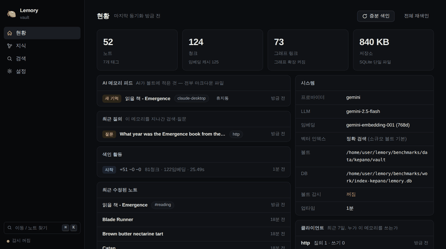

## 데모 모음, 전부 실제로 동작하는 화면입니다

각 클립은 작은 한국어 데모 볼트에서 **실제 CLI 출력을 글자 그대로** 다시
찍은 것입니다. 재생성 스크립트는 `docs/assets/make_gifs.py`에 있고, 캡처
원문도 스크립트 안에 있습니다. 목업은 없습니다.

| | |
|---|---|
| **즉답 검색** `--fast` · 임베딩 0회, 3.8ms<br>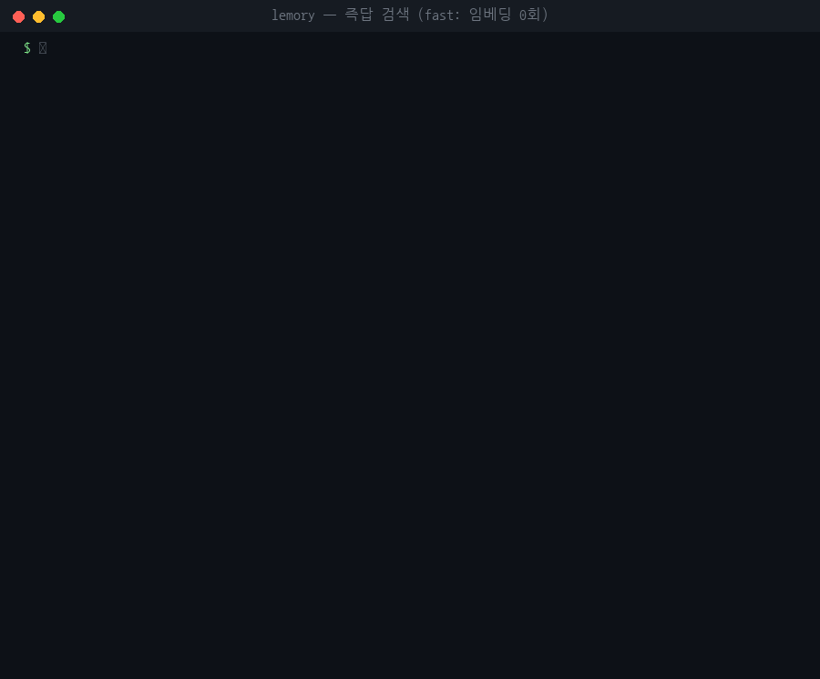 | **모순 탐지** `lemory conflicts` · 기억 vs 기억<br>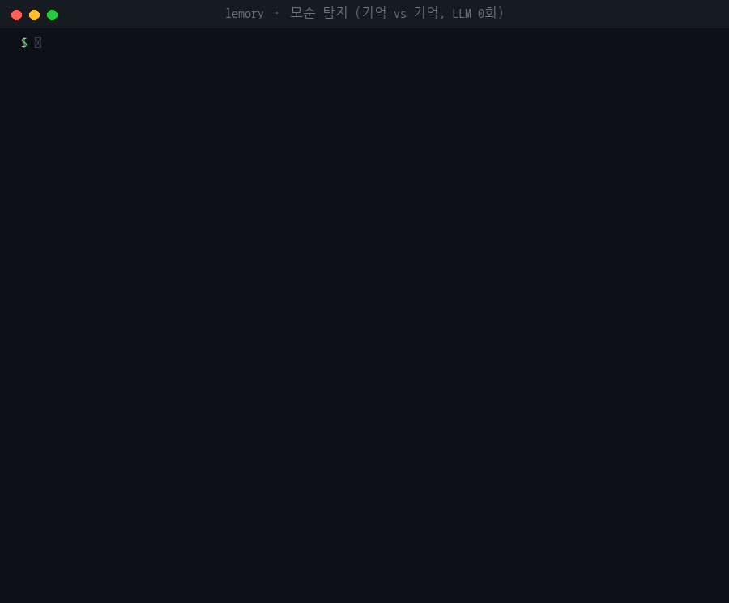 |
| **AI 쓰기 승인** pending → approve<br>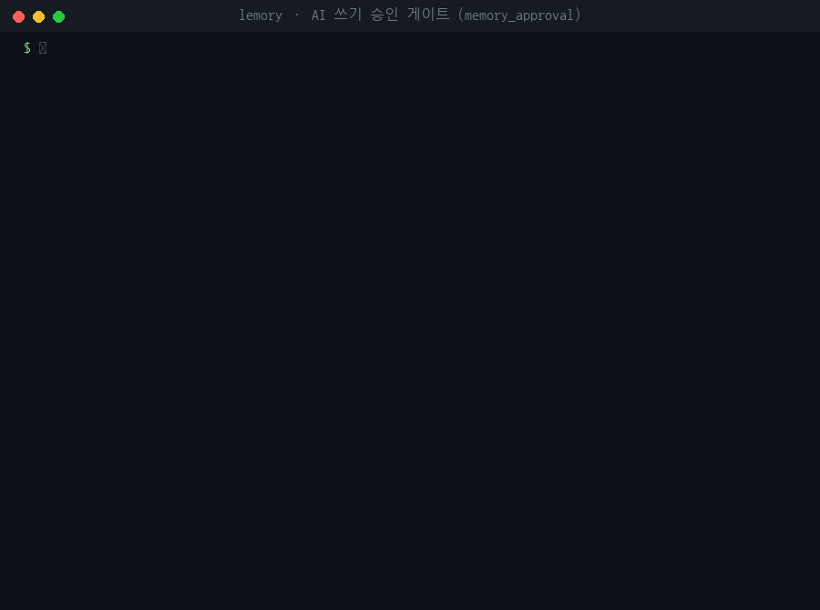 | **드리프트 감지** `lemory drift` · 기억 vs 현실<br>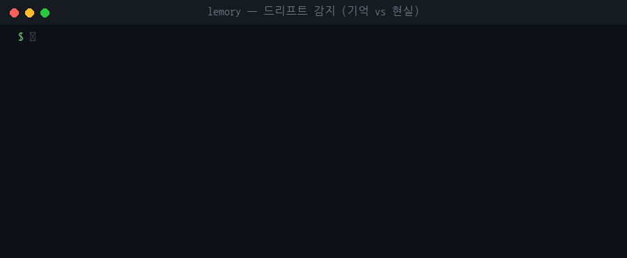 |
| **범위 연산자** `tag:` `folder:` `path:` `after:` `before:`<br>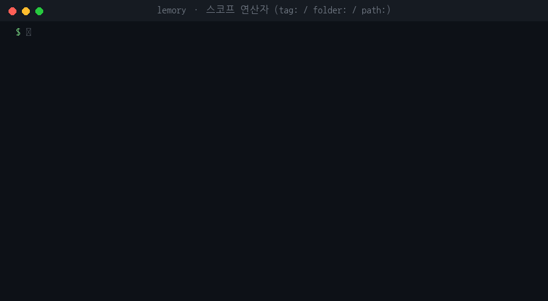 | **시간 인지** "요새 작업하던…" → 최신 결정 1위<br>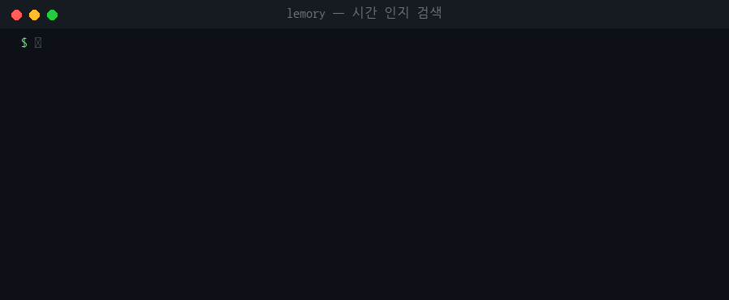 |
| **오타 교정** FoundatoinDB → FoundationDB<br>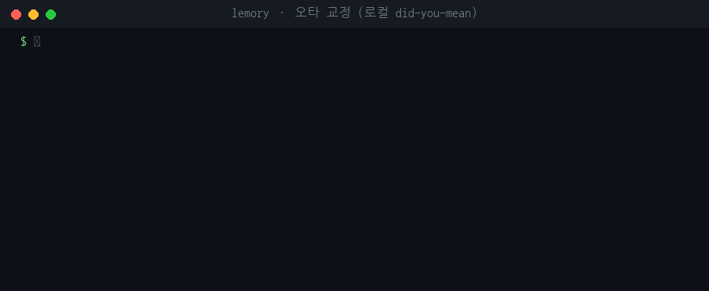 | **대규모 검증** KorQuAD 9,663문단 × 60,407질문<br>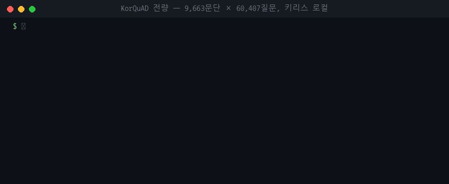 |

## 콘솔

`lemory serve` → `127.0.0.1:8377`. 옵시디언을 또 만든 것이 아니라,
*미들웨어에 무엇이 오갔는지* 보고 바로 손보는 작업 공간입니다. 데스크톱
지식앱의 문법을 웹 콘솔 비용으로 담았습니다: 토큰 기반 디자인
시스템(라이트/다크), ⌘K 팔레트, ⌘1–8 이동, `?` 단축키 도움말, 하단 상태바.

- **현황**: 타임라인입니다. AI 메모리 피드(되돌리기 포함), 최근 질의와
  출처, 클라이언트별 사용량, 색인 활동을 볼 수 있습니다.
- **지식**: 3열 워크스페이스입니다(열 폭은 드래그로 조절하고 기억됩니다).
  목록에는 노트마다 한 줄 미리보기, 상세에는 스티키 헤더 · 클릭되는
  경로 브레드크럼 · 긴 노트 목차(읽는 위치를 따라오는 스크롤 스파이).
  그리고 **직접 씁니다**: 새 노트 · 이름 변경 · 휴지통, 구문 하이라이트
  에디터 + 라이브 미리보기, `[[위키링크]]` 자동완성, 1.5초 자동 저장
  (디스크 충돌은 409로 보호), frontmatter **속성 인스펙터**(태그는 칩으로
  더하고 뺍니다).
- **기억**: 피라미드(페르소나 · 장면 · 앵커 · 케이스 · 스킬)와 타입별
  회상입니다.
- **그래프**: 볼트 전체 상호작용 그래프입니다.
- **건강**: 승인 대기 기억, 모순 쌍, 드리프트, 링크 제안을 한 화면에서
  처리합니다.
- **검색**: 하이브리드/벡터/키워드를 바꿔가며 점수와 속도를 볼 수 있는
  실험실입니다. 빈 화면 대신 내 볼트로 만든 튜토리얼이 표시됩니다.
- **비서**: 온디바이스 모델로 볼트에 대해 스트리밍 대화합니다(출처 인용).
- **설정**: 검색 옵션과 모델 선택을 바로 적용합니다. 타임라인 기록 여부도
  설정이고(`event_log`), 전부 내 SQLite 파일에만 남습니다.

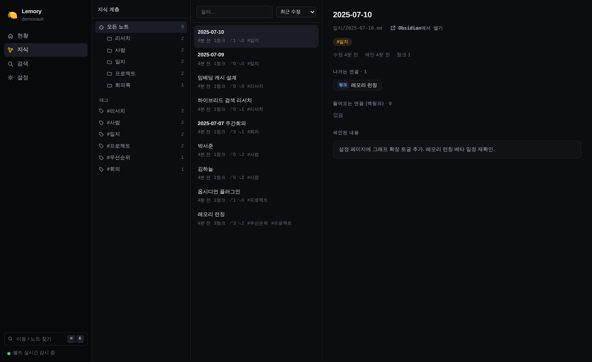

## 파일 vs 행: 개인 지식에는 파일이 이깁니다

Lemory와 가장 비슷한 것은 mem0의 OpenMemory(대시보드 있는 로컬 MCP
메모리)입니다. 차이는 "기억"이 *무엇이냐*입니다.

| | **Lemory** | OpenMemory (mem0) | supermemory 셀프호스트 | basic-memory | qmd |
|---|---|---|---|---|---|
| 기억이란 | **내 마크다운 파일** | Postgres+Qdrant의 행 | 전용 저장소의 레코드 | 마크다운 파일 | (읽기 전용 인덱스) |
| 실행 형태 | 프로세스 1개, SQLite 1개 | Docker: Postgres + Qdrant + UI | 바이너리 + 외부 임베딩 | pip 패키지 | bun CLI |
| 기존 노트를 읽나 | **예, 그것이 존재 이유** | 아니요 (대화에서 추출) | 업로드 | 부분적 | 예 |
| 색인 LLM 호출 | **0** | 대화마다 | API 쪽 | 0 | 0 |
| 대시보드 | 타임라인 + 되돌리기 + 클라이언트 | 기억 CRUD UI | 콘솔 | 없음 | 없음 |
| 검색 (직접 측정) | **멀티홉 1.000 · 약 3ms** | 0.579 · 212ms | 0.579 · 327ms | 측정 불가¹ | 0.526 · 0.6~59초 |
| 한국어 검색 | **CJK 바이그램 + 오타 교정** | 영어 우선 | 영어 우선 | 영어 우선 | 영어 우선 |
| 떠날 때 비용 | 없음, 파일이 남음 | 내보내기/이사 | 내보내기/이사 | 없음 | 없음 |

<sub>¹ basic-memory는 그래프 탐색 중심이라 순위 검색이 없습니다. 측정된
수치는 전부 같은 조건, 같은 모델, 같은 데이터: [방법론](BENCHMARKS.md).</sub>

추출 방식(행)의 기억은 내 말의 *요약*입니다. 저장할 때 정보가 깎이고,
나중에 검증할 수 없습니다. 파일 방식은 실제 노트를 날짜와 맥락 그대로
가져옵니다. 검색 품질을 측정할 수 있는 것도 그 덕분입니다.

## 합성 데이터가 아니라 실제 데이터로 증명합니다

**사람들이 실제로 묻는 방식대로**: 말 바꿔 묻기, 영어 노트에 한국어 질문,
키워드만 던지기, 오타까지 (full-support@8):

<div align="center">
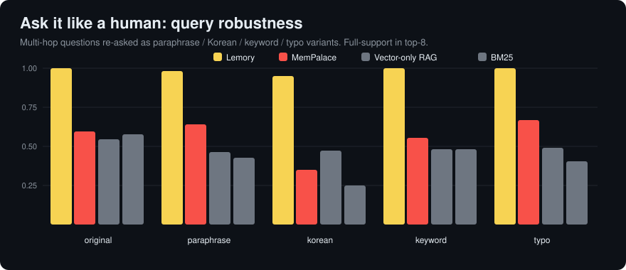
</div>

**멀티홉, LLM 그래프 진영과의 대결.** 내 `[[위키링크]]`와 제목 언급이
이미 지식그래프입니다. 그것을 무료로 읽는 쪽이, LLM 파이프라인으로
그래프를 만드는 쪽보다 높게 나왔습니다:

<div align="center">
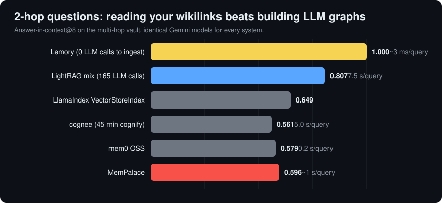
</div>

| | **Lemory** | LightRAG | MemPalace | mem0 | cognee | supermemory | LlamaIndex | qmd |
|---|---|---|---|---|---|---|---|---|
| 멀티홉 answer-in-context@8 | **1.000** | 0.807¹ | 0.596 | 0.579 | 0.561 | 0.579 | 0.649 | 0.526 |
| 2-hop 질문만 | **1.000** | 0.738 | 0.452 | 0.548 | 0.405 | - | 0.524 | 0.381 |
| 색인, 54노트 | **LLM 0회, 약 30초** | 165회, 14분 | 로컬 임베딩 | 노트당 1~2회 | 약 45분 | API 쪽 | 0 | 0 |
| 검색 지연 (p50) | **약 3ms** | 7.5초² | 약 1초³ | 212ms | 약 5초 | 327ms | 649ms⁴ | 0.6~59초 |
| 한국어 질문 (full-support) | **0.950** | - | 0.350 | - | - | - | - | - |

<sub>¹ LightRAG에 유리하게 채점했습니다. 병합된 컨텍스트 덩어리가 다른
시스템의 8청크보다 큽니다. LLM으로 만든 그래프는 진짜이고 경쟁 최고 2-hop
점수지만, 색인에도 질의에도 LLM 비용을 냅니다. ² 무료 티어 제한 하의
질의당 LLM 호출 포함, 유료면 1~2초. ³ 프로세스 기동 포함 실측, 그들이
내세우는 zero-API 구성. ⁴ 질의마다 API 임베딩, 캐시 없음. 로컬 전용이면
약 2ms.</sub>

**업계 표준 메모리 벤치마크도 있습니다.** LongMemEval_S 전체 500문항,
API 호출 0, 로컬 임베더만으로:

<div align="center">
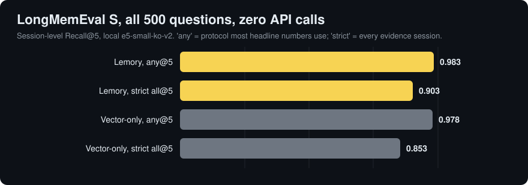
</div>

다들 헤드라인에 쓰는 기준으로 Recall@5 **0.983**. 그리고 더 엄격한
전-증거 기준(0.904)을 앞에 세웁니다. 유리한 숫자만 골라 쓰지 않습니다.
LOCOMO LLM 채점 0.706 vs mem0 공개 수치 0.669, DMR(500문항) 0.694 vs 같은
조건 naive RAG 0.668입니다 ([§7b](BENCHMARKS.md)).

**롤플레잉 기억, 캐릭터 챗에 진짜 필요한 축.** 직접 만들어 공개한
**RoleMemQA**([§7e](BENCHMARKS.md)): 8명의 페르소나 × 30세션, 단기/장기/
에피소드/취향 변경/시간/2홉/거절까지 144문항(정답은 코드로 검증). 키 없이
**doc@1 0.977**, 취향이 바뀐 질문 1.000에 옛 취향 함정에 속은 비율 **0**.
자기 벡터(0.938)·키워드(0.820) 경로를 모두 이기면서 약 1ms입니다. 이
벤치가 잡아낸 실제 결함 2개도 바로 고쳤습니다.

**[KorQuAD 1.0](https://korquad.github.io/)**: 실제 한국어 위키피디아
140개 문서, 사람이 쓴 질문 400개, 키 없이 로컬로:

| System | Recall@1 | Recall@5 | MRR@10 |
|---|---|---|---|
| **Lemory** (hybrid+graph) | **0.930** | 0.980 | **0.951** |
| BM25 | 0.900 | **0.985** | 0.937 |
| Vector-only RAG | 0.840 | 0.953 | 0.887 |

<sub>이 표는 오랫동안 BM25가 이겼고, 저희는 그동안 그 사실을 그대로
실었습니다. 2026년 7월 한국어 검색 개선이 마침내 뒤집었습니다. 400문항
표본은 동점 처리에 따라 ±2문항 흔들립니다. 그래서 10배(4,000문항)로도
측정했고, 현재 코드가 r@1 0.9795로 앞섭니다(BENCHMARKS §7e). 옛 표는 깃
히스토리에 있고, 실전에서 중요한 숫자는 위의 강건성 차트입니다.</sub>

**[KorMapleQA](benchmarks/data/kormapleqa/README.md)** 는 저희가 만들어
공개하는 기여입니다. 실제 나무위키 메이플스토리 문서 1,469개 위의
2,075문항. 100% 코드로 만들고 기계로 검증해서 API 키 없이 재현되고, LLM이
쓴 질문 특유의 편향이 없습니다.

저희가 만들지 않은 실제 볼트도 있습니다. 옵시디언 CEO Steph Ango의 공개
볼트와 공식 Obsidian Help 볼트입니다 ([§5d](BENCHMARKS.md)).

## 한국어가 1등 시민입니다

이 분야 대부분은 한국어를 나중 일로 미룹니다. Lemory는 벤치마크로
다룹니다.

- **한글 + 가나 + 한자 바이그램 색인**: 조사가 붙은 어절,
  `ナイトロード나이트로드` 같은 혼합 표기까지 전부 찾습니다. 보통의
  토크나이저는 이것을 찾을 수 없는 한 덩어리로 붙여버립니다.
- **음절 단위 오타 교정**: `메플이스토리`로 메이플스토리를 찾습니다. 옆
  글자끼리 바뀐 오타를 편집 1회로 계산합니다. 한국어 오타가 실제로 나는
  방식이기 때문입니다.
- **활용을 아는 인용 감지**: `만든`으로 `만들었다`를 찾습니다. 자모 수준
  어간 매칭이 활용, ㄹ탈락, 띄어쓰기 차이를 버팁니다.
- 영어 노트에 한국어로 물어도 0.950. BM25는 0.250, MemPalace는
  0.350입니다.

## 이런 것이 됩니다

```
$ lemory ask "3분기 킥오프에서 예산 얼마로 잡았지?"                 # 회의록
$ lemory ask "데이터플랫폼팀 리드가 누구고 무슨 일 하는 팀이지?"      # 조직/사람
$ lemory ask "재택근무 정책, 작년이랑 지금이랑 뭐가 달라졌지?"        # 시간 축 비교
$ lemory ask "자바스크립트 이벤트 루프 뭐였지? 내 노트 기준으로"      # 공부 노트
$ lemory ask "카오스 벨룸 가기 전에 준비물 뭐라고 적어놨더라?"        # 게임 노트
$ lemory ask "오사카에서 갔던 그 라멘집 이름이 뭐였지?"              # 여행 기록
```

일반 RAG가 구조적으로 못 하는 것들:

```
$ lemory ask "프로젝트 아틀라스 리드가 좋아하는 DB가 뭐더라?"
# 멀티홉: 아틀라스 노트 → [[리드]] 링크 → 그 사람 노트에 답이 있습니다

$ lemory ask "요새 내가 읽던 책 뭐였지?"
요즘 읽는 책은 어스시의 마법사이다 [1, 3].     # 시간: *지금* 책
$ lemory ask "3월에 읽던 책은?"                # 3월을 물으면 그때 기록으로

$ lemory search "tag:회의록 folder:2026 예산"   # 범위 연산자, 전 모드
$ lemory remember "VPN 갱신은 매년 3월, 담당 김하늘" --tags ops   # CLI에서 기억 남기기
$ lemory import-chats conversations.json        # ChatGPT/Claude 대화 → 검색되는 노트
$ lemory connect ./my_source.py                 # 커넥터 SDK: 어떤 소스든 → 볼트 노트
$ lemory agents install                         # AGENTS.md 생성, 어떤 에이전트든 볼트를 기억으로
$ lemory graph --open                           # 볼트 전체를 인터랙티브 그래프로
$ lemory context                                # 에이전트용 볼트 요약 한 번에
```

오타는 내 볼트의 단어들을 기준으로 교정됩니다(API 없음). 이름 변경, 삭제,
별칭, 한국어 파일명도 워처가 실시간으로 따라갑니다. `default_scope`를
설정하면 모든 질문이 기본으로 그 폴더/태그 안에서 돌고(`scope:all`로 한
번만 해제), 질문에 연산자를 직접 쓰면 그것이 항상 우선입니다.

## 왜 잘 되는가: 마법이 아니라 구조입니다

- **멀티홉 1.000 vs 0.53~0.81 (전원)**: 검색이 링크를 따라 1홉
  확장하는데, 질의 유사도와 키워드 증거 둘 다 확인하고, 직접 증거보다
  높아지지 않게 눌러둡니다. 색인할 때 LLM 없이 미리 캐시합니다.
- **강건성 0.95+ vs 0.25~0.67**: 벡터와 키워드는 *다르게* 실패합니다.
  가중 융합이 둘을 덮습니다. 질문이 노트를 거의 그대로 인용하면 키워드
  순위를 그대로 고정합니다(핀). 순위만 섞는 융합은 확실한 키워드 우위를
  존중할 수 없기 때문입니다.
- **초가 아니라 밀리초**: 전부 한 프로세스, SQLite FTS5 + numpy. 청크
  2만 개를 넘으면 IVF-int8 인덱스로 자동 전환됩니다. **청크 100만 개에서
  5.9ms/질의, 정확 검색 대비 recall 1.000, RAM 732MB**
  ([§12b](BENCHMARKS.md)). SQLite를 다른 것으로 바꾸는 실험도 했고 왜 안
  바꿨는지 공개했습니다 ([보고서](docs/STORAGE.md)).
- **비용은 0에 수렴합니다.** 임베딩 캐시, Gemini 무료 티어로 하루 약
  250질문, 그리고 바이트 하나 못 나가는 망분리 환경을 위한 완전
  온디바이스 모드까지 지원합니다.

## 개발자라면

```python
import lemory
lemory.configure(vault="~/Obsidian/MyVault")
lemory.index()
print(lemory.ask("가격 정책 뭐라고 결정했더라?").text)
```

TypeScript/Node는 의존성 0인 클라이언트가 [`clients/js`](clients/js)에
있습니다: `new Lemory({client: "my-agent"}).search(...)`.

파이썬 프레임워크에는 그대로 끼워 넣으면 됩니다(둘 다 실제 프레임워크로
테스트했습니다):

```python
from lemory.integrations.langchain import LemoryRetriever     # langchain-core
from lemory.integrations.llamaindex import LemoryLlamaRetriever  # llama-index-core
```

셀프호스팅: `docker build -t lemory . && docker run -p 127.0.0.1:8377:8377
-v ~/vault:/vault lemory`. 뭔가 이상하면 `lemory doctor`가 볼트, 인덱스,
FTS5, 임베더, 생성기를 한 번에 점검합니다. 그 출력을 이슈에 붙여주시면
됩니다.

[Cerebras의 사내 지식베이스 글](https://www.cerebras.ai/blog/how-we-built-our-knowledge-base)에서
가져온 것도 출처를 밝힙니다. **랭킹 후 이웃 복원**: 순위가 정해진 뒤 각
청크에 앞뒤 문맥을 다시 붙여, 잘려나간 전제와 주의사항을 되살립니다
(`context_neighbors`). **대화 버스트 청킹**: 같은 화자의 연속 발화 중
알맹이 있는 것만 골라 따로 색인하되, 융합에서는 자기 노트의 순위를 올리는
역할만 합니다(실측 내역 전체가 §7e에 있습니다). 그들의 나머지 핵심 설계는
Lemory가 이미 만들어 측정한 것들이었습니다.

격차 분석으로 추가된 것들: `lemory ask --deep`(어려운 질문을 쪼개서 각각
검색 후 증거 병합), `lemory backup`/`restore`, `index_docx = true`(Word
텍스트 추출), `lemory connect`(커넥터 SDK), `default_scope`(기본 검색
범위), 그리고 **모바일**: `lemory serve --host 0.0.0.0` + `api_token`이면
폰에서도 토큰 인증으로 붙고, localhost는 그대로 무설정입니다.

실패한 실험도 정책대로 공개합니다. **시맨틱 폴백 링크**(링크 없는 노트에
유사도 간선)는 만들었고, 측정했고, **효과가 없다는 것이 확인돼** 기본으로
꺼뒀습니다. **리랭커의 시간 보정**도 실제 모델로 3팔 비교(끔 0.978 / 켬
0.889 / 켬+보정 0.867)한 뒤 되돌렸습니다. 이득만 남기고 실패는 기록합니다.

REST는 `lemory serve`에: `GET /search` · `POST /ask` · `GET /context` ·
`POST /memory` · `POST /append` · `POST /memory/trash` · `POST /index` ·
`GET /status`, 대시보드 API(`/api/events`, `/api/clients`, `/api/notes`,
`/api/related`, ...)도 있습니다. `X-Lemory-Client` 헤더로 정체를 밝히면
대시보드에 출처가 표시됩니다.

옵시디언 사이드바 플러그인(파일 3개 복사면 설치 끝), PDF 색인
(`pip install 'lemory[pdf]'`, `index_pdf = true`), 검색 옵션 전체는
[`lemory.toml`](docs/GUIDE.ko.md), 깊은 이야기는
[BENCHMARKS.md](BENCHMARKS.md) · [docs/STORAGE.md](docs/STORAGE.md) ·
[docs/COMPETITIVE.md](docs/COMPETITIVE.md)에 있습니다.

## 어떻게 동작하는가

```
 내 볼트 (*.md) ──감시──► 파싱: frontmatter · 태그 · [[링크]] · 날짜
                                 │
                                 ▼
              SQLite 파일 하나: 청크 · BM25 · 링크 그래프 · 임베딩 캐시
                              + 이벤트 타임라인      + IVF-int8 (큰 볼트)
                                 │
 질문 ─► 오타 교정 ─► 벡터 + 키워드 (융합) ─► 제목·최신성 부스트
                                 │
                        1홉 그래프 확장   ← 멀티홉 답이 여기서 나옵니다
                                 │
                                 ▼
              날짜와 출처가 붙은 컨텍스트 ─► LLM ─► 답변 [n]

 save_memory ─► 중복 검사 ─► 볼트 안의 .md ─► 다음 질문부터 검색됩니다
```

검색은 로컬이고 LLM이 없습니다(3~13ms). 질문당 임베딩 1회(캐시됨),
`ask()`당 생성 1회입니다.

## 정직하게 말하면

- 문서를 그대로 인용하는 질문은 오랫동안 순수 BM25가 유리했습니다. 저희는
  그것이 사실인 동안 그대로 실었습니다. 2026년 7월에 뒤집혔고, 옛 수치는
  깃 히스토리에 있습니다.
- qmd의 간판 모드에서도 이제 품질까지 앞섭니다(동일 문항 0.875 vs 0.769).
  예전 임베더로는 동률이었습니다. 약 3,700배의 속도 차이는 원래부터
  있었습니다.
- kepano의 작은 영어 볼트에서는 벡터 단독이 한 문제 차로 저희를 이깁니다.
  BENCHMARKS에 그렇게 적혀 있습니다.
- 청크 4만 2천 개 코퍼스의 2-hop full-support는 측정한 전원에게
  어렵습니다. 저희 로컬 수치는 0.477로 올라왔지만, 상시 도전 과제로
  남겨뒀습니다.
- 타 팀의 공개 수치는 다른 생성기/채점 기준이라 참고로만 인용합니다. Zep의
  DMR 94.8은 GPT-4급 구성이고, 이겼다고 말하지 않습니다.
- SQLite를 바꾸는 실험(DuckDB, LanceDB)에서 LanceDB의 텍스트 검색이 최악
  케이스에서 실제로 5배 빨랐습니다. 그것을 공개하고도 SQLite에 남습니다.
  나머지 네 항목은 SQLite가 이깁니다 ([전체 보고서](docs/STORAGE.md)).
- 버스트 청킹의 후퇴도 기록에 있습니다. 깨끗한 노트 1문항, 번복 함정
  1문항입니다. 고치려던 패치가 다른 함정을 무너뜨려서 접었고, 이득과
  후퇴를 함께 공개했습니다 (§7e).

## 로드맵

- [ ] PyPI (`pip install lemory`) · [ ] 옵시디언 커뮤니티 플러그인 등록
- [x] AI 쓰기 경로 + 되돌리기 있는 타임라인 · [x] 클라이언트 출처 표시
- [x] 기억 정리 (중복 표시 + 관련 링크)
- [x] 링크 제안 · [x] 인터랙티브 그래프 · [x] 어시스턴트 스킬
- [x] PDF 색인 · [x] 100만 청크 볼트용 ANN 인덱스
- [x] 채팅 가져오기 (ChatGPT/Claude) · [x] KorMapleQA 벤치마크
- [x] 커넥터 SDK (`lemory connect`) · [x] 기본 검색 범위 (`default_scope`)
- [x] 에이전트 온보딩 (`lemory agents`: AGENTS.md + 감지) · [x] AI 쓰기 git 체크포인트
- [ ] 이미지 OCR / 오디오 전사 · [ ] 웹 클리퍼
- [ ] 멀티 볼트 프로필

## 함께 만듭니다

`uv venv && uv pip install -e ".[dev,mcp,local,pdf]" && pytest` 한 줄이면
테스트 500여 개가 완전 오프라인으로 돌아갑니다.
[CONTRIBUTING.md](CONTRIBUTING.md) · 한국어 이슈/PR 환영합니다.

처음부터 로컬 우선으로 설계했습니다. 신뢰 모델, 로컬 서버의 보안 장치,
취약점 신고 방법은 [SECURITY.md](SECURITY.md)에 있습니다.

**[English README](README.en.md)** · MIT
